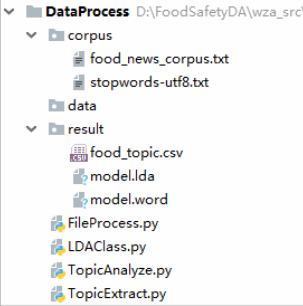
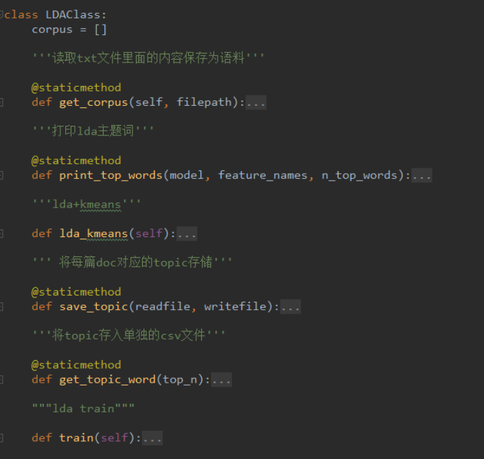
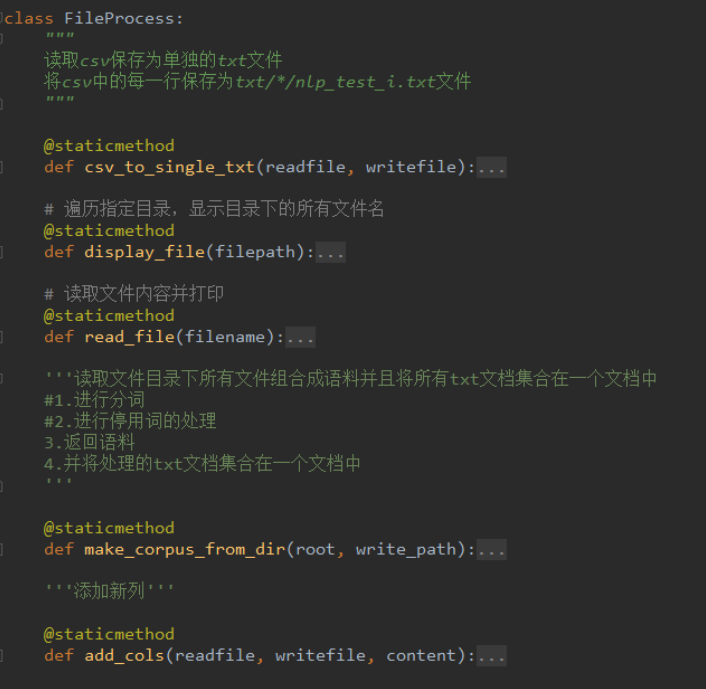
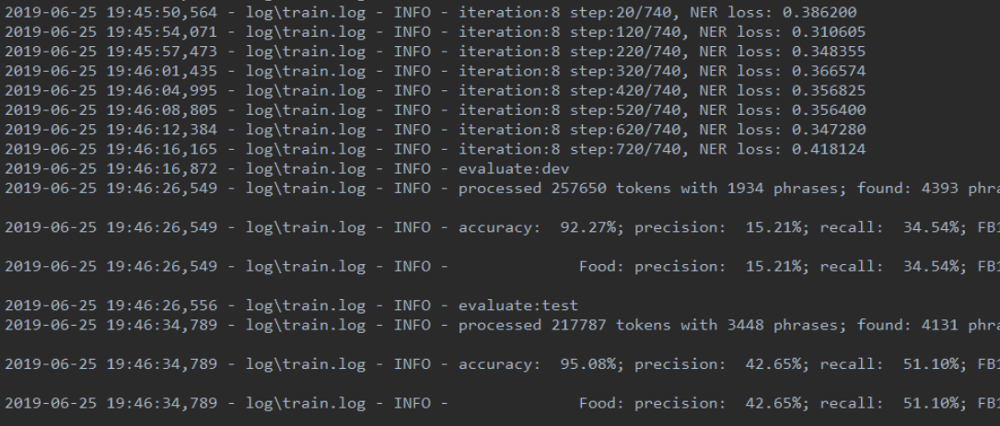

# 第2周周报——王子昂 #

## 本周完成的工作 ##

### 梳理代码 ###

* 分析邓娜数据处理（清洗、分词）、话题提取、事件检测部分的代码

#### 数据处理 ####

* 将爬取到的新闻信息存储在csv文件中，包括序号、时间、新闻内容等
* 将每一条新闻的内容抽取为单独的txt文本，方便进行下一步的处理
* 对每条新闻内容，利用停用词表，去除停用词、制表符、html标签，分词，将分词结果存放到语料库中，同时将每篇文章的分词结果保存到对应的txt文件中

#### 话题提取 ####

* 主题困惑度分析，进行测试集、训练集划分，构建语料库，进行向量转化，得到对应主题数下的困惑度，得到困惑度最小时的主题数
* 利用Python lda包中的LDA模型输入语料、主题数进行训练，并将模型保存
* 提取每个话题对应的TOP-N的主题词，保存到csv文档中
* 对爬取的新闻信息进行主题的标注
* 根据主题不同，将不同主题的新闻事件进行归类，将相同主题的新闻信息放到一个文件夹下

#### 事件检测 ####

* 从新闻中抽取一部分数据，利用YEDDA工具人工标注新闻中出现的实体，其中食品专有名词标记为FOOD，其余为OTHER
* 将标记好的数据划分为训练集、开发集、测试集，送入命名实体识别模型中进行训练，得到一个能对食品安全专有名词进行标注的模型
* 在运行时发现，一方面由于标记的数据量太小，再加上送入的句子文本过长，导致精度很低，基本不能识别出实体，需要进行改进。
* 利用食品专有名词，以及新闻文本进行相似度计算，得到话题中存在的事件。

### 代码重构 ###

* 对LDA模型部分的数据处理、模型训练进行重构

  

* 抽取出LDA类进行模型训练、关键词提取，使结构更加清晰，抽取参数，增加代码的可重用性，同时对构建出的模型进行保存，避免重复训练

  

* 对于数据处理部分，抽取参数，去掉重复、无用代码，并添加必要注释

  

* 命名实体识别模型部分，利用标点符号以及文字长度对数据集中的新闻进行切分，重新进行训练，准确率得到了较大的提升，下一步可以考虑对更多的数据进行标注，来提高准确率，同时除了标记食品名词，还可以添加对地点、人物的标注

  

### 讨论之后开发方向 ###

* 丰富数据源：添加社交媒体（微信公众号、微博）、视频新闻（央视网、优酷）、新闻网站的数据
* 优化命名实体识别模型的构建，对更多的数据进行标注，增加标记的数据类型
* 进行食品安全热点事件的趋势分析