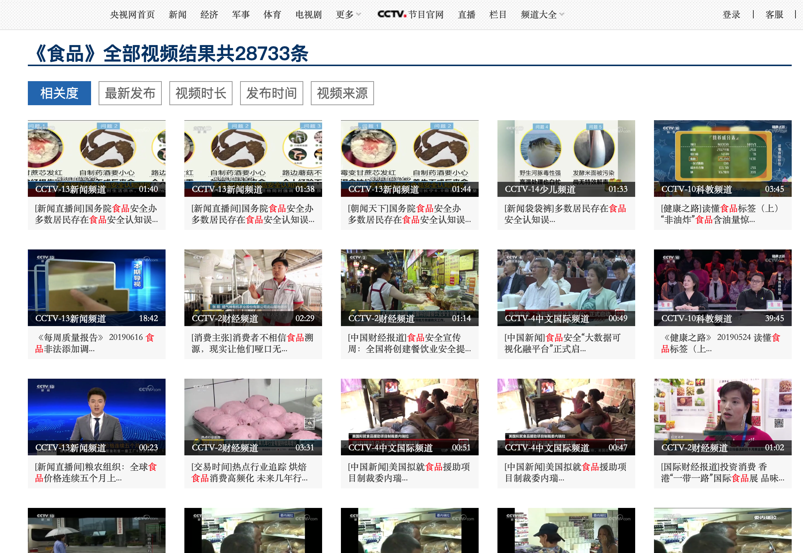
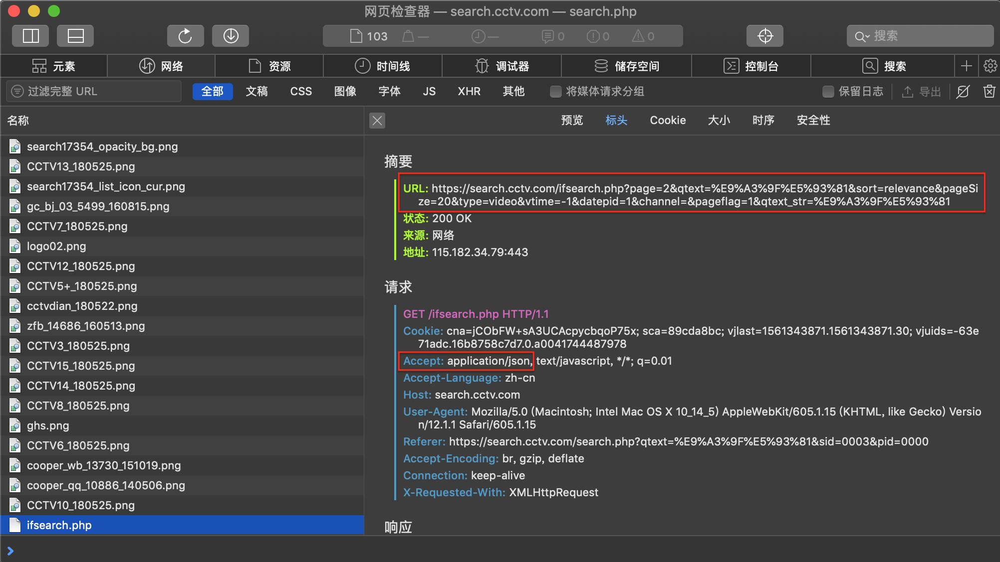
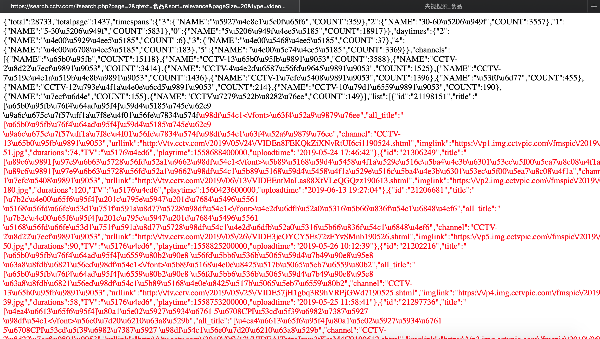
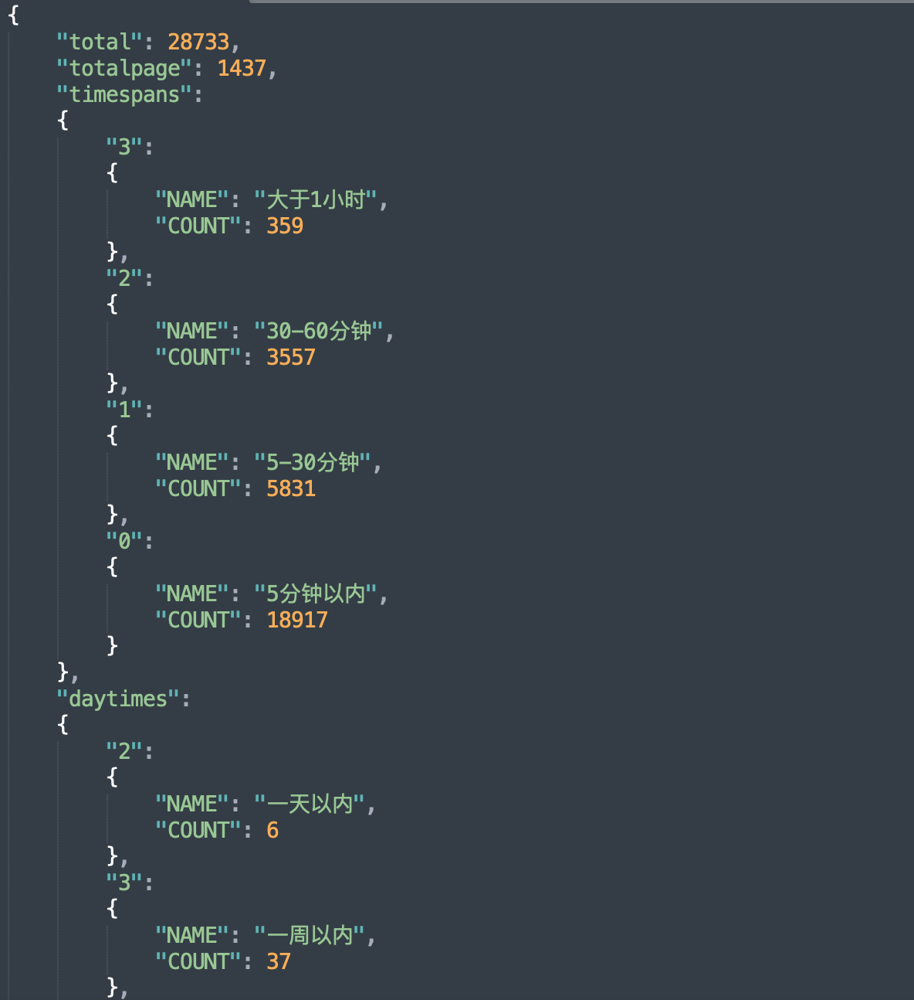
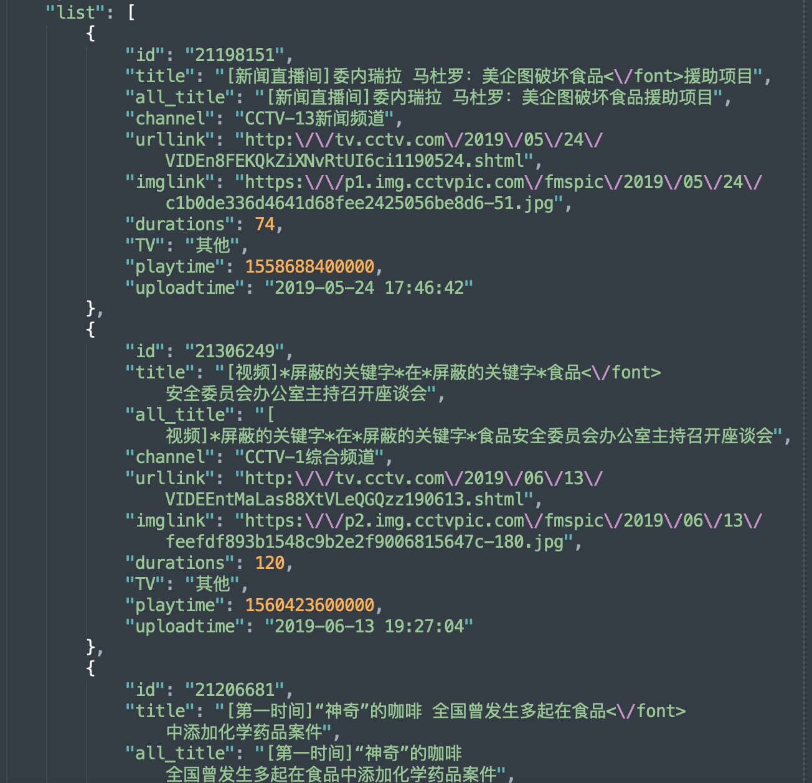
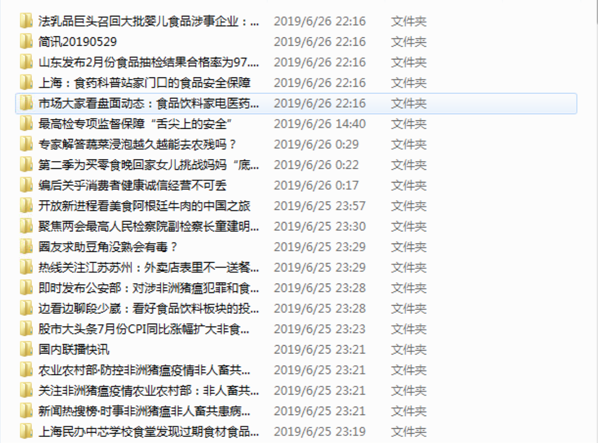
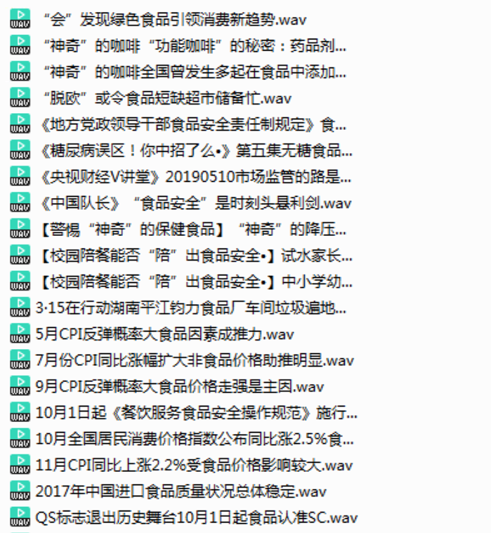
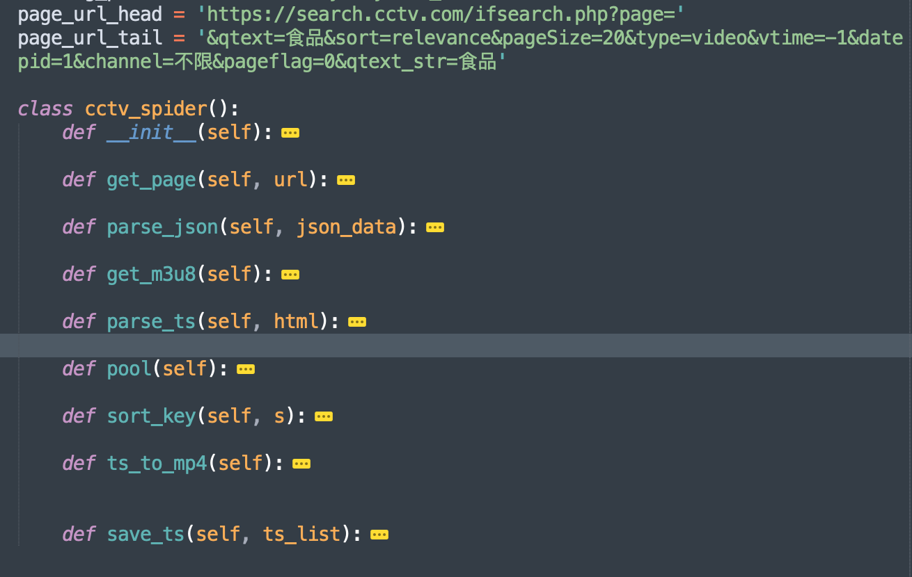
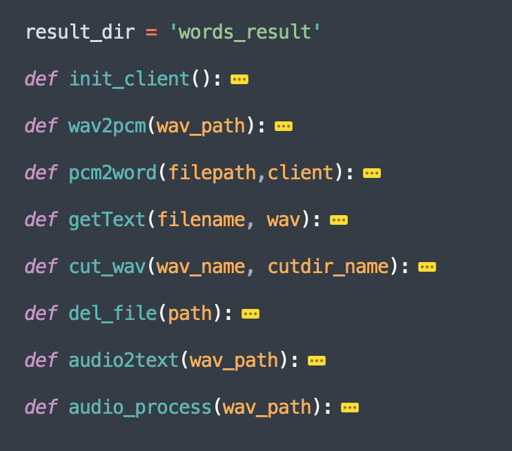
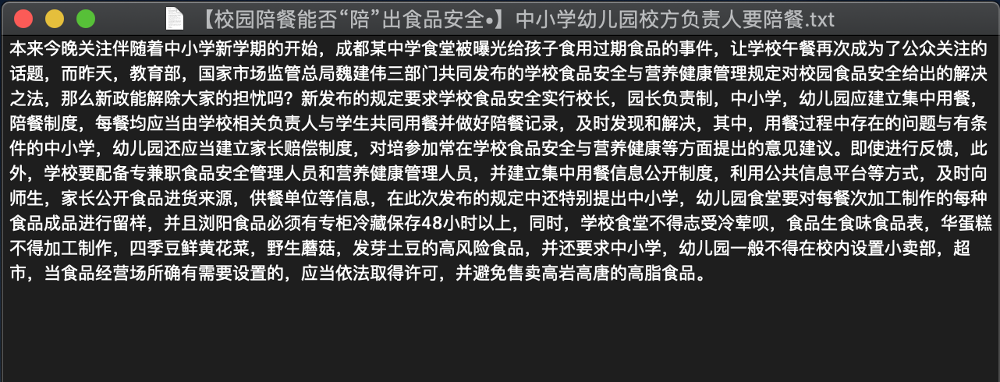

# 周报-第1周-余连玮

## 本周完成的事情

### 爬取视频数据并转音频

编写爬虫代码爬取央视网上的食品相关视频数据。

1. 首先在央视搜索食品相关视频

   

2. 通过研究网页检查器中的网络部分，能够找到搜索所用的接口，如下图中摘要中的url，通过传递参数来搜索。查看请求头也能发现，接收的响应格式是json格式。

   

3. 于是尝试性的将摘要中的url输入到浏览器地址栏，发现成功得到了每一页请求的响应结果，利用工具转换成中文可以观察到搜索网页的规律。total表示搜索的总视频数。totalpage表示搜索结果能够显示的页数；下面的list中存放着每一个视频的信息，可以通过urllink找到视频对应的网页。通过title-urllink对来记录视频信息，利用channel和duration来过滤太长的和不需要的视频。

   

   

   

4. 由于视频是分段播放和存放的，因此得到网页后找到记录视频序列的m3u8文件，进而根据url规则找到分段的视频文件（`*.ts`格式），然后下载下来。

   

5. 然后利用ffmpeg工具拼接ts文件并转换为wav格式的音频文件，以便后续文字提取。

   

具体函数见下图，video_crawler.py文件：

爬虫到300左右个视频后发现后续的视频一直是重复的，查看央视网的搜索结果发现50页后的视频一直是重复的，因此并没有搜索结果说的2万多个视频。无奈之下只能下周爬取其他视频网站的食品相关视频。

### 音频文字提取

1. 为了得到符合api要求的音频格式，得到wav音频文件后，将其分段、转pcm格式。
2. 然后调用百度语音识别api工具对pcm文件进行文字提取，最后将得到的文字存入txt文件中。该过程耗时较久，平均提取一个音频的文字需要30s。

具体函数见下图，audio_process.py文件：

识别后的文本示例如下：

### 修改实训计划

为了做出更加实用性的成果，我和王子昂一起改进了实现计划，修改后的内容见下页。

