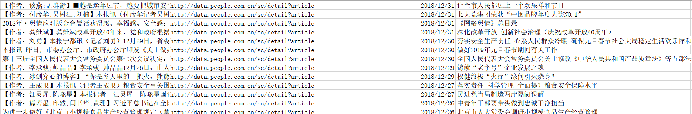
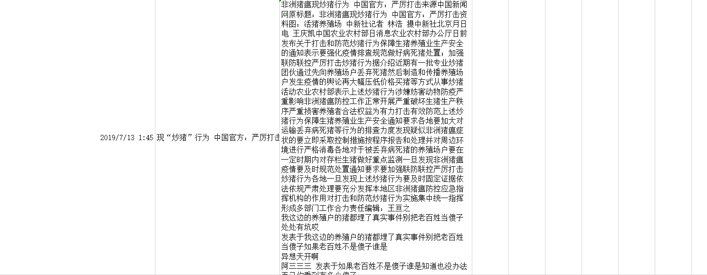

# 第3周周报——王子昂 #

## 初步确定趋势分析步骤 ##

与余连玮商量后，制定了趋势分析的具体计划：

1. 获取2018年一整年的食品安全相关的数据。
2. 进行数据处理后，送入LDA模型中训练，得到一年中所有的主题及所有文档对应的主题。
3. 提取出一年中Top-N的主题，统计一年中这些主题的热度趋势
4. 对这些主题做后续的热度预测。

## 爬取食品伙伴网 ##

> 爬取食品资讯板块[中国食品栏目](http://news.foodmate.net/guonei/)2018年的新闻，利用scrapy框架，共爬取到10304条数据

* 通过分析URL规律实现分页爬取

  http://news.foodmate.net/guonei/list_250.html

  * 250代表第250页的内容，通过该数字的增加实现各个页面的爬取

* 通过xpath获取列表页面的信息：标题、发布时间、新闻详情页的连接

  

  * html界面如下，通过xpath解析信息

  

  ```python
  li_list = sel.xpath("//div[@class='catlist']/ul/li[@class='catlist_li']")
      for content in li_list:
          link = content.xpath("./a/@href").extract()[0]
          title = content.xpath("./a/@title").extract()[0]
          time = content.xpath("./span/text()").extract()[0]
  ```

* 对于时间符合要求（2018年）的数据，利用获得的详情页URL再进一步爬取新闻内容、行业、标签、地点，利用xpath进行解析

  

* 在pipeline中进行数据存储，能够保存为表格、json、存入Mongo数据库

  存入数据库中的数据如图中所示：

  

  导出为表格如下：

  

## 爬取国家食药监督总局 ##

> 爬取[食品、保健食品欺诈和虚假宣传整治板块](http://samr.cfda.gov.cn/WS01/CL1972/index.html)2018年的新闻，共爬取到6760条数据

* 利用使用Selenium模拟浏览器行为进行爬取

* 利用BeautifulSoup对网页进行解析，获得相应的内容

* 将内容存储到csv文件中

  

## 爬取人民日报数据库 ##

> 爬取[人民日报数据库](http://data.people.com.cn/)关键词搜索结果，通过搜索“食品安全”关键词，得到840条数据

* 人民日报数据库需要付费登录才能访问，但通过武大图书馆可以直接进行访问，因此分析了武大图书馆提供的访问人民日报数据库的链接，通过Selenium模拟浏览器行为，打开浏览器进行访问，得到登陆状态，再进行进一步的爬取

* 人民日报搜索的URL较为特殊，采用附加Json的形式

  `http://data.people.com.cn/sc/ss?type=1&qs=%7B%22cds%22%3A%5B%7B%22cdr%22%3A%22AND%22%2C%22cds%22%3A%5B%7B%22fld%22%3A%22title%22%2C%22cdr%22%3A%22OR%22%2C%22hlt%22%3A%22true%22%2C%22vlr%22%3A%22OR%22%2C%22val%22%3A%22%E9%A3%9F%E5%93%81%E5%AE%89%E5%85%A8%22%7D%2C%7B%22fld%22%3A%22subTitle%22%2C%22cdr%22%3A%22OR%22%2C%22hlt%22%3A%22true%22%2C%22vlr%22%3A%22OR%22%2C%22val%22%3A%22%E9%A3%9F%E5%93%81%E5%AE%89%E5%85%A8%22%7D%2C%7B%22fld%22%3A%22introTitle%22%2C%22cdr%22%3A%22OR%22%2C%22hlt%22%3A%22true%22%2C%22vlr%22%3A%22OR%22%2C%22val%22%3A%22%E9%A3%9F%E5%93%81%E5%AE%89%E5%85%A8%22%7D%5D%7D%5D%2C%22obs%22%3A%5B%7B%22fld%22%3A%22dataTime%22%2C%22drt%22%3A%22DESC%22%7D%5D%7D`

  经过分析，URL可分解为下面的结构

  ```python
  SpecificBaseUrl = r"http://data.people.com.cn/sc/ss?qs="
  
  GlobalJsonPart = {"clds": "23",
                    "cds":
                        [{"cdr": "AND",
                          "cds":
                          [
                          {"fld": "title", "cdr": "OR", "hlt": "true", "vlr": "AND", "val": ""},
                          {"fld": "subTitle", "cdr": "OR", "hlt": "false", "vlr": "AND", "val": ""},
                          {"fld": "introTitle", "cdr": "OR", "hlt": "false", "vlr": "AND", "val": ""},
                          {"fld": "contentText", "cdr": "OR", "hlt": "true", "vlr": "AND",
                                "val": ""}]}],
                    "obs": [{"fld": "dataTime", "drt": "DESC"}]}
  ```

* 由于只需要2018年的数据，为减少爬取的数据量，通过人工审阅，2018年的数据分布在30页到60页，请求的页数可直接附加在请求的URL中

* 通过对搜索页面进行解析，提取各个结果详情页的URL存入链表

* 对每一个URL进行访问获取详情内容

* 由于该数据库存在反爬虫机制，同一个IP多次访问会导致服务器禁止IP访问，通过更换User Agent，建立IP池，来防止这种情况的发生，一旦出现请求错误，更换IP同时`sleep`一段时间再重新进行访问



## 爬取微信公众号历史文章 ##

> 爬取“中国食品网”、“中国食品安全报”、“中国食品安全网”三个公众号2018年发布的文章，共得到5120条数据


## 爬取中国食品安全网 ##

> 爬取[中国食品安全网](http://www.cfsn.cn/)首页各个类别下的所有新闻，基于原有代码进行修改

* 利用request获得URL对应的html页面
* 利用BeautifulSoup对网页进行解析，获得相应的内容
* 首先获取首页各个栏目的URL
* 其次判断每一类别下有几页，获取每一页的链接
* 之后获取每一页下符合时间条件的新闻链接
* 再爬取每一条新闻的具体内容
* 将结果存入csv


## 爬取食品论坛搜索结果 ##

> 爬取[食品论坛](http://bbs.foodmate.net)关键词搜索的结果，并爬取帖子中的所有内容

- 利用使用Selenium模拟浏览器行为进行爬取
- 利用BeautifulSoup对网页进行解析，获得相应的内容
- 首先获得搜索页的信息包括标题、发布时间，以及帖子详情页的URL，再通过页面分析得到下一个搜索页的URL
- 对于每一个搜索结果，对帖子的具体内容进行爬取，依然采用分页爬取的策略，获得帖子中的所有信息，以此来分析话题的热度
- 将内容存储到csv文件中



