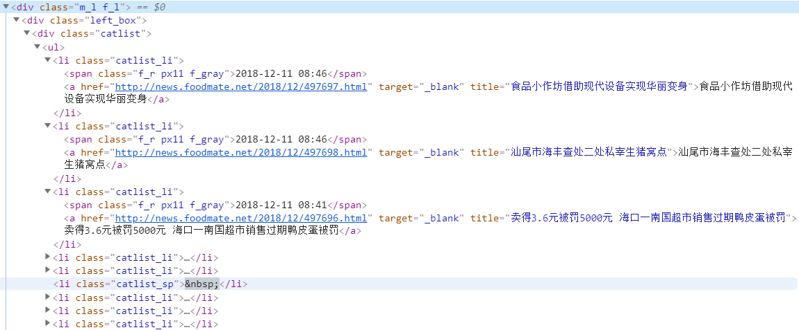

# 第3周周报——王子昂 #

## 初步确定趋势分析步骤 ##

与余连玮商量后，制定了趋势分析的具体计划：

1. 获取2018年一整年的食品安全相关的数据。
2. 进行数据处理后，送入LDA模型中训练，得到一年中所有的主题及所有文档对应的主题。
3. 提取出一年中Top-N的主题，统计一年中这些主题的热度趋势
4. 对这些主题做后续的热度预测。

## 爬取食品伙伴网 ##

> 爬取食品资讯板块[中国食品栏目](http://news.foodmate.net/guonei/)2018年的新闻，利用scrapy框架，共爬取到10304条数据

* 通过分析URL规律实现分页爬取

  http://news.foodmate.net/guonei/list_250.html

  * 250代表第250页的内容，通过该数字的增加实现各个页面的爬取

* 通过xpath获取列表页面的信息：标题、发布时间、新闻详情页的连接

  

  * html界面如下，通过xpath解析信息

  

  ```python
  li_list = sel.xpath("//div[@class='catlist']/ul/li[@class='catlist_li']")
      for content in li_list:
          link = content.xpath("./a/@href").extract()[0]
          title = content.xpath("./a/@title").extract()[0]
          time = content.xpath("./span/text()").extract()[0]
  ```

* 对于时间符合要求（2018年）的数据，利用获得的详情页URL再进一步爬取新闻内容、行业、标签、地点，利用xpath进行解析

  

* 在pipeline中进行数据存储，能够保存为表格、json、存入Mongo数据库

  存入数据库中的数据如图中所示：

  

  导出为表格如下：

  

## 爬取国家食药监督总局 ##

> 爬取[食品、保健食品欺诈和虚假宣传整治板块](http://samr.cfda.gov.cn/WS01/CL1972/index.html)2018年的新闻，共爬取到6760条数据

* 利用使用Selenium模拟浏览器行为进行爬取

* 利用BeautifulSoup对网页进行解析，获得相应的内容

* 将内容存储到csv文件中

  

