# 第4周周报——王子昂 #

## 数据处理 ##

* 文件编码格式转换：爬虫结果的表格为gbk编码，通过重新编码转换为utf-8
* 将csv中的每一行信息（标题+内容）保存为单独的txt文件，方便下一步的处理
* 对每一篇文章进行基本的数据清洗，去掉其中的html标签、字母、制表符、无用的符号，方便进行标注和命名实体识别
* 创建语料：对上一步清洗后的数据再进行分词、去停用词处理，将每篇文章的处理结果作为最终语料库中的一行，将生成的语料存储在`news_content_corpus.txt`中，最终共得到35687行
* 前三条文章处理结果如下图所示：

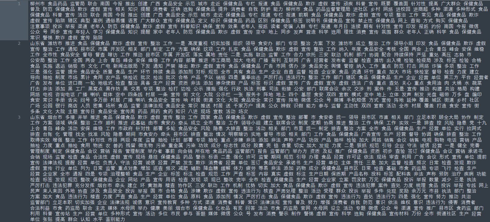

## LDA主题提取 ##

* 对比了gensim、sklearn、lda三个包下的LDA模型

  * sklearn中的LDA模型基于变分推断EM算法
  * lda中的LDA模型基于Gibbs采样

* 基于困惑度确定主题数

  * 将语料库中的内容按照8:2划分为训练集和测试集

  * 将训练集和测试集的内容随机打乱

  * 选取至少出现过两次并且数量为前2000的词来生成文本表示向量

  * 用得到的向量生成器转化训练集和测试集

  * 利用sklearn中的LDA模型进行模型训练，主题数选取1~100以5为间隔，分别计算不同主题数下得到的LDA主题模型的困惑度，绘制主题数和困惑度的对应关系，如下图所示：

    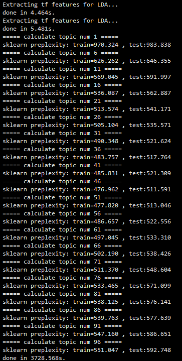

    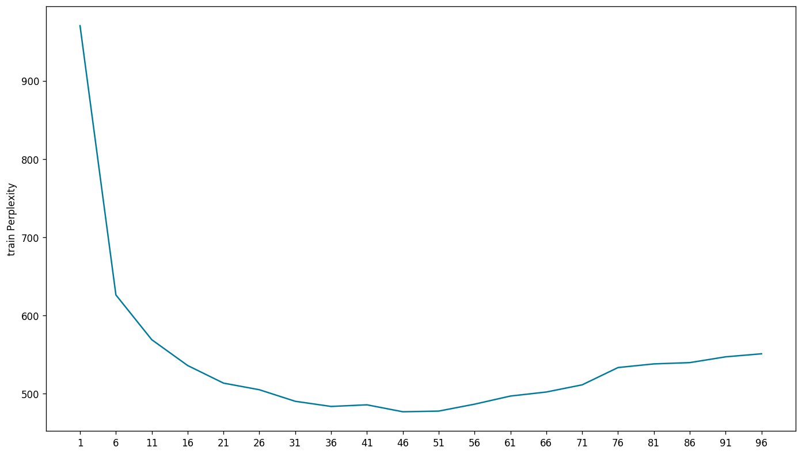

  * 选取可能的取值范围以更小的粒度重新进行分析

    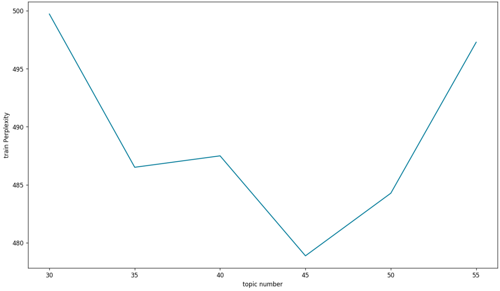

  * 选取困惑度最小时的主题数（45）作为最终的主题数

* LDA模型训练：利用lda包下的LDA模型进行训练，选取主题数为45，迭代100次，将训练后的模型保存

* 获得每个主题的关键词

  * 得到LDA模型的主题——词分布
  * 获取每个主题下概率值最大的前20个词来代表该主题

  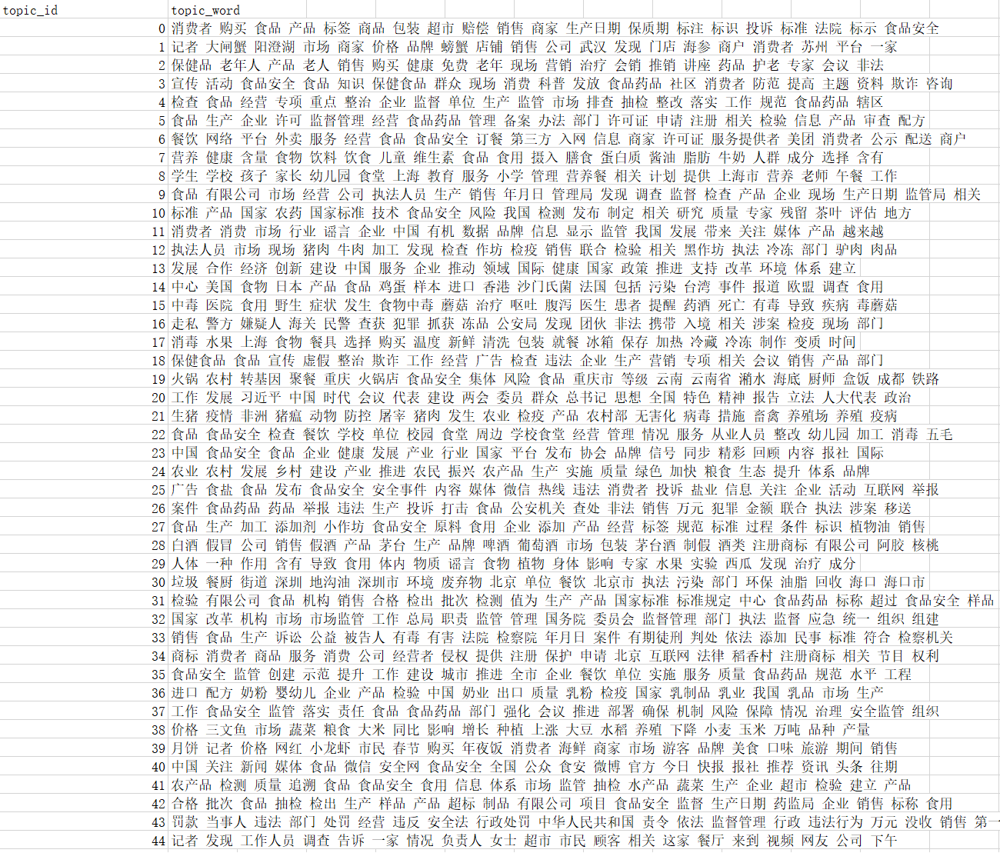

* 获得每个文档的主题

  * 得到LDA模型的文档——主题分布

    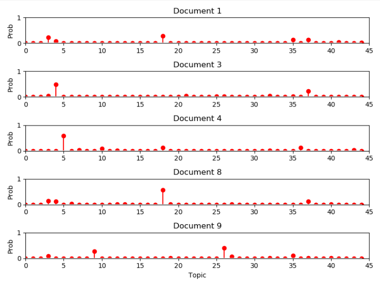

  * 选择可能性最大的主题作为文档的主题

  * 将每个文档对应的主题编号存储到csv中，格式为`[doc_id,topic_id]`

  * 将主题提取的结果写回原始的`all_news_data.csv`文件，在最后加一列表示文档的主题

## 命名实体识别 ##

### 数据标注 ###

* 对于进行了初步数据清洗的文档，随机抽取1000条进行标注
  * 最开始我们打算利用一个模型同时标记人名、机构名、时间、地点、食品安全专有名词，但这样的标记效率太低，我们尝试了一段时间就放弃了。
  * 后来我们利用已有的标记了人名、机构名、时间、地点的数据集，进行训练。因此只需要对文档中的食品安全专有名词进行标注，得到一个新的模型用来识别食品安全专有名词，提高了标记速度，但由于只有两个人标记，标注还是花费了很长的时间。
  * 后期有条件的话，希望能够动员更多人对数据进行标注，有望能进一步提高模型的准确率
* 使用YEDDA工具标记文档中的食品安全专有名词，如：保健食品、非洲猪瘟、五毛食品、明厨亮灶....

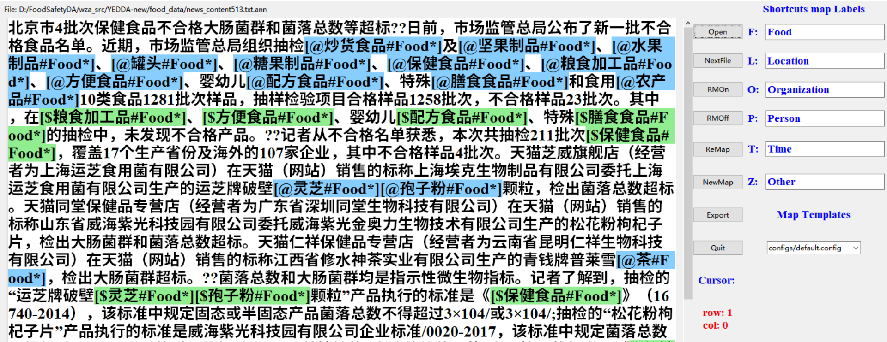

* 采用BIO标注方式，标注好的样本如图所示：

  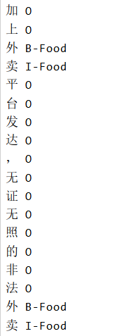

### 模型训练 ###

* 对于标记好的数据进行基本的清洗，由于标记的数据中存在对空格标记为O的现象，而直接训练会产生错误，利用正则表达式去掉这种情况

* 由于文档较长，对于标记好的数据，根据标点符号进行切分，将长文本转换为较短的文本，有助于提高训练的准确率

* 将切分好的数据按照 7:2:1 的比例划分为训练集、测试集、开发集，送入BiLSTM-CRF 模型进行训练，得到相应的模型

  模型评估结果如下：

  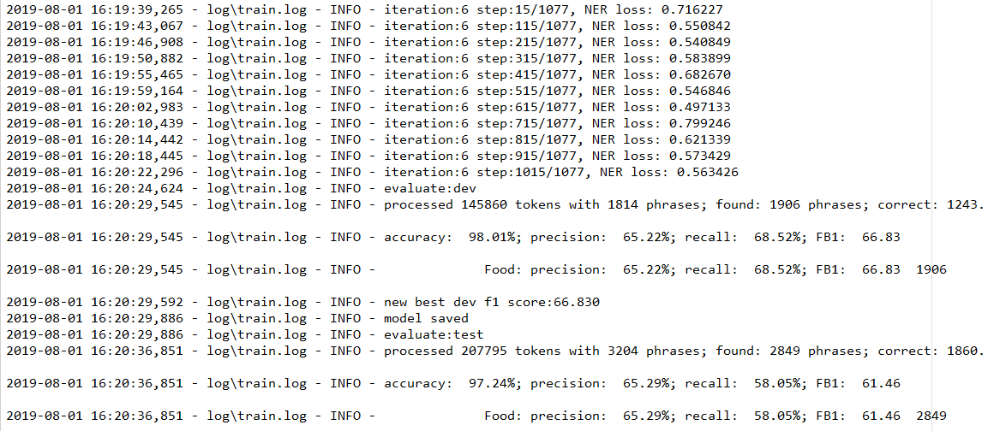

* 获得标注好的人名、机构名、时间、地点数据集，送入BiLSTM-CRF 模型进行训练，得到相应的模型

  模型评估结果如下：

  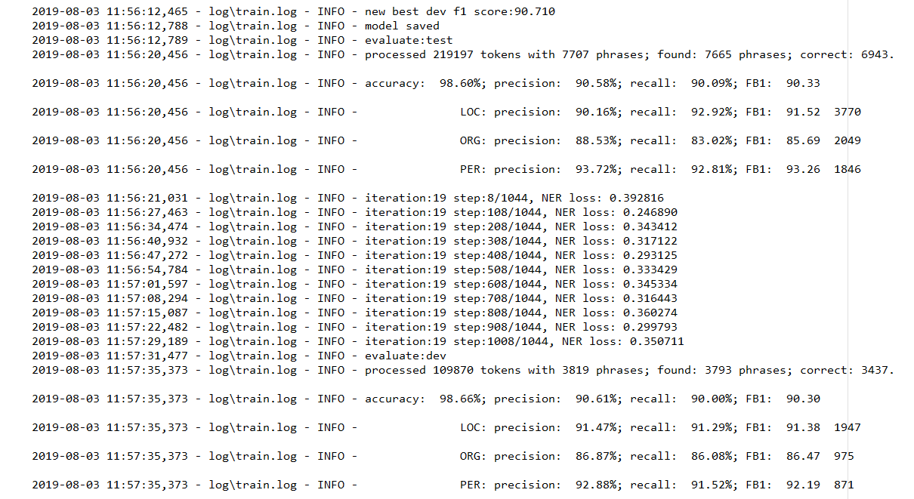

### 测试结果 ###

#### 时间、地点、人名、组织名 ####

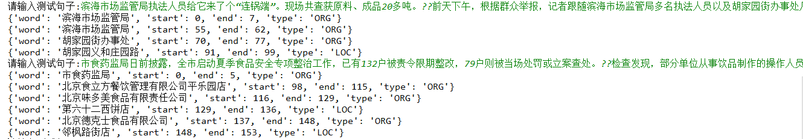

#### 食品安全专有名词 ####

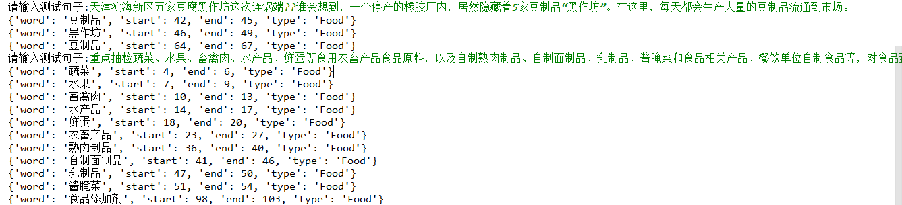

## 向量化 ##

> 构建Word2Vec模型

* 利用数据处理中获得的语料，利用`word2vec.Text8Corpus`方法转化，作为模型的输入
* 设置词向量的维度为50，对Word2Vec模型进行训练
* 最后将得到的模型进行保存
* 测试结果如下

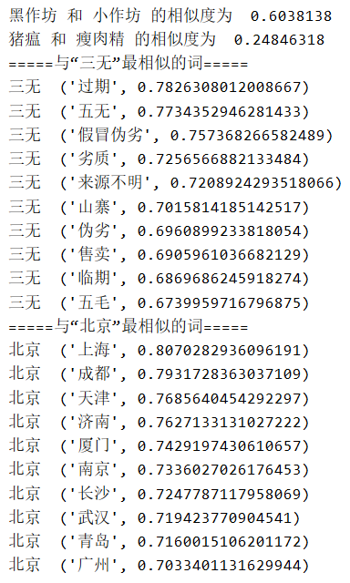

