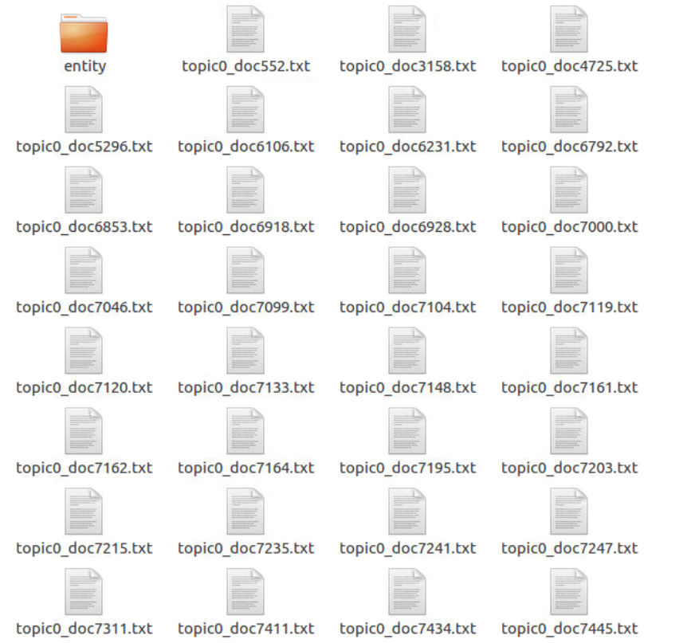

# 周报-第4周-余连玮

## 本周完成的事情

### 一、命名实体识别模块

#### 1. 打乱数据

- 首先对文档进行初步的数据清洗，去掉出现的多余换行符、特殊符号、英文乱码等。

- 然后从中随机抽取1000条数据进行标注。

#### 2. 标注食品专有名词

使用YEDDA工具标记文档中的食品安全专有名词，如：保健食品、非洲猪瘟、五毛食品、三无食品、明厨亮灶等。

- 最开始我们打算利用一个模型同时标记人名、机构名、时间、地点、食品安全专有名词，但这样的标记效率太低，并且太多特征送入模型，模型难以学会，准确率不高，因此我们尝试了一段时间就放弃了。
- 后来我们利用已有的标记了人名、机构名、时间、地点的数据集，进行训练，直接得到了能够识别人名、机构名、时间、地点的模型。
- 因此只需要对文档中的食品安全专有名词进行标注，得到一个新的模型用来识别食品安全专有名词，提高了标记速度。但由于只有两个人标记，标注还是花费了很长的时间。

- 使用YEDDA工具标记文档中的食品安全专有名词，如：保健食品、非洲猪瘟、五毛食品、明厨亮灶....

  

- 采用BIO标注方式，标注好的样本如图所示：

  

#### 3. 训练模型

- 由于文档较长，对于标记好的数据，根据标点符号进行切分，将长文本转换为较短的文本，有助于提高训练的准确率。
- 将切分好的数据按照7：2：1的比例划分为训练集、测试集、开发集，送入BiLSTM-CRF 模型进行训练，得到相应的模型。
- 获得标注好的人名、机构名、时间、地点数据集，送入BiLSTM-CRF 模型进行训练，得到相应的模型。

- **食品安全专有名词模型训练日志：**

  - 可以看到，f1最高只能达到66.83，效果并不是特别理想。我们猜想原因有以下几个：
    - 训练数据不够多。
    - 数据中的干扰项比较多，虽然进行过预处理，但是仍然存在一些特殊符号和数字英文乱码。
    - 非食品安全相关的数据较多，应该先进行文本分类，剔除与食品安全不相干的数据。
  - 后期有条件的话，希望能够动员更多人对数据进行标注，有望能进一步提高模型的准确率。

  

- **食品安全专有名词模型测试结果：**

  

- **其他名词模型训练日志：**

  

- **其他名词模型测试结果：**

  

### 二、事件提取模块

事件提取模块主要分为以下几个步骤：

#### 1. 数据预处理

1. 按主题存放文档
   - 在利用LDA模型进行主题提取后，每个文档都有了对应的主题id。
   - 每个主题建立一个独立的文件夹，将分词后的文档按主题id分到对应的主题文件夹中。
   - 主题文件夹：
   - 主题0下的文档及命名实体文件夹：

2. 提取所有文档的命名实体
   - 调用训练好的识别命名实体的模型，提取出一个文档所有的专有名词，去重后，拼接成类似分词序列的形式，存入对应的主题文件夹中。
   - 主题0下所有文档的命名实体：
   - 主题0下其中三个文档的命名实体序列：

#### 2. 训练模型

1. 训练一个Doc2Vec模型
   - 对于每个主题的文档训练一个Doc2Vec模型。
   - 将一个主题下的所有文档一起送入模型中训练。
   - 每个主题的Doc2Vec模型：
2. 训练Word2Vec模型（这部分由王子昂完成）
   - 对于整个语料库训练一个Word2Vec模型，用于后续将命名实体向量化。

#### 3. 文本向量化

1. 文档文本向量化
   - 利用训练好的Doc2Vec模型，将每一篇文档转换成一个句子向量。
   - 句子向量采用简单的词向量相加并归一化来处理得到。效果意外的还不错。

2. 命名实体向量化
   - 利用训练好的Word2Vec模型，将每一个命名实体转换为一个词向量。
   - 整个分词序列向量也采用上述的句子向量获取方式：词向量相加并归一化得到。

- 句子转向量的函数：

#### 4. 相似度计算

- 利用加权相似度来表示总体相似度：

  **Sim(d1, d2) =w \* Sim_doc(d1, d2) + (1-w) \* Sim_entity(d1, d2)**

- 由于下面用到层次聚类，将用户定义距离函数`get_distance(d1, d2)`作为层次聚类的距离函数，只能传递两个向量函数，所以在上一步向量化时将两个向量拼接起来，一起传入距离函数中。在距离函数中则利用切片，分别计算文档相似度和命名实体的相似度。

- 使用欧式距离来代表相似度。

#### 5. 层次聚类

学姐的论文中指出：先选定一个文档d1作为一个事件，然后对于后续的每一个文档di，计算文档d1,di的相似度，然后与给定阈值进行比较，如果大于这个阈值，则表示两个文档较为相似，因此di与d1看做同一个事件；如果小于这个阈值，则表示两个文档不太相似，因此di与d1看做不同的事件。对于后续的每个事件都要与已经看作独立的事件的文档比较相似度。

这个思想其实和层次聚类是很相似的，因此直接利用层次聚类的方法来进行事件提取。

- 利用scipy.cluster.hierarchy的层次聚类函数linkage进行层次聚类，上述步骤计算相似度的函数作为层次聚类的距离函数。
- 将聚类后的结果矩阵存储下来，便于后续进行分析；并将聚类过程画成树状图。
  - 主题0聚类过程：

## 下周需要完成的事情 ##

### 分析层次聚类结果 ###

本周由于花费较多的时间在数据标注上，导致后期进行事件提取模块时间较少，未能很好地分析和利用层次聚类的结果。

因此下周继续分析层次聚类结果，了解最后的结果矩阵各维度的含义、画出其他更加直观，能反映聚类情况的图。

### 进行趋势分析 ###

这部分是学姐论文中未涉及到的部分，因此需要先进行大体的规划才能动手实现。预计进展比较困难，需要花费较多的时间。