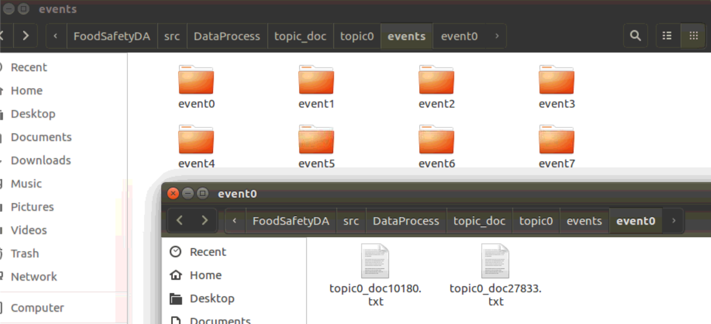
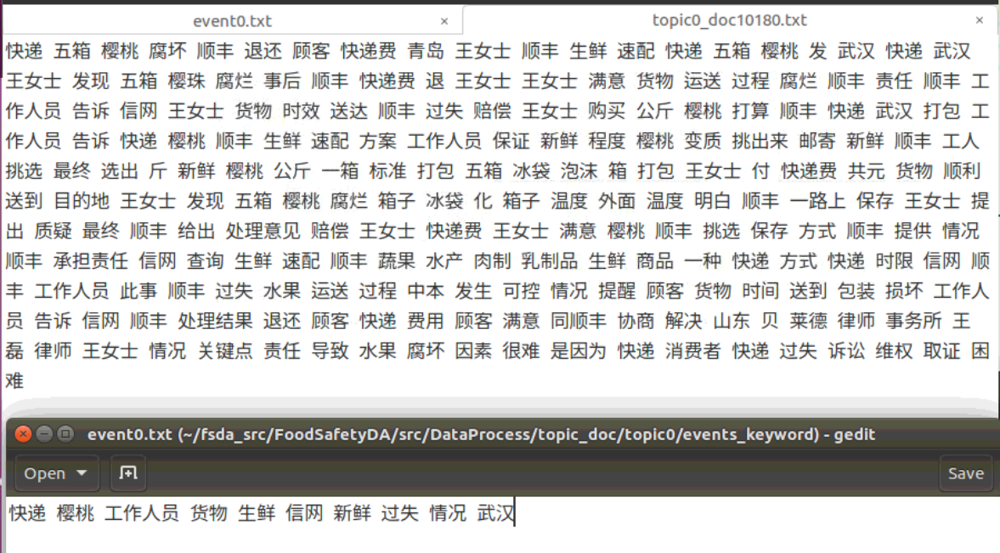
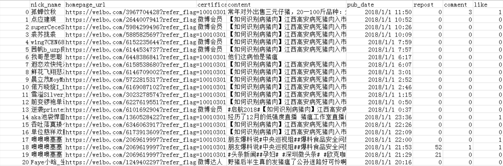
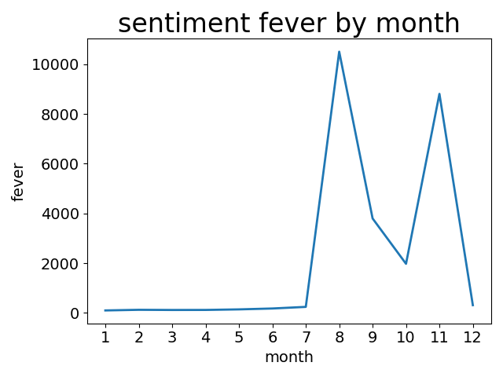

# 第4周周报——王子昂 #

## 抽取聚类结果 ##

* 获得存储每篇文章属于哪个类的矩阵；再获得矩阵中每个下标代表哪篇文章的列表
* 根据上述两个信息进行匹配，得到每一个主题下各个事件由哪些文档组成，对于每一个主题返回一个二维矩阵，每一行为一个事件，每一列为组成事件的文档
* 每个主题下新建文件夹`events`存放主题中的事件
* 对于主题中的每一个事件新建文件夹`event_i`存放属于该事件的文档
* 通过获得的主题聚类结果矩阵找到每个事件的对应文档，并复制到对应的事件文件夹

## 获得各个事件的关键词 ##

> 分别尝试利用textRank和tf-idf两种算法进行关键词提取

* 将事件中包含的文档进行拼接
* 将文本内容送入相应的算法进行关键词提取
* 获得排名前10的关键词，存储到txt文本中，以事件编号命名

## 获得微博舆情信息 ##

> 爬取了微博上2018年有关“非洲猪瘟”的全部信息（用户信息，微博内容，发布时间，评论数、点赞数、回复数，用户的微博认证）共获得了56992条数据

* 由于之前的爬虫是通过接口获得微博的搜索结果，由于存在页数限制，只能得到最近2个月左右的搜索结果，由于我们需要获得2018年全年的数据，因此并不能使用之前的爬虫
* 通过探索发现微博具有高级搜索功能，可以对时间段进行筛选，再尝试中发现信息最多只能展示50页，超过50页会回到第一页，从而出现循环爬取的问题
* 为突破微博的反爬虫机制，同时实现登录，采用Selenium模拟浏览器行为，打开浏览器进行访问，首先模拟登录，再通过搜索进行爬取
* 第一次登陆后会记录cookie信息，这样再次爬取时就无需再次登陆了
* 对于数据不是特别多的时间段采用1天作为时间间隔进行爬取，对于数据相当多的日期如8-3日采用2小时作为时间间隔进行爬取，防止出现页数过多循环爬取的状况
* 这种循环爬取的问题也为爬取带来了很大的麻烦，由于实现并不能确定那天的信息量很大需要降低爬取间隔，单纯把间隔设置的很低又会导致爬取速率过慢的问题，因为本身通过Selenium模拟浏览器的方式进行爬取就需要等待网页加载等等，耗费的时间本来就比request的方式长很多。
* 在搜索页面中通过xpath获得微博中的各项信息 
* 后期可以考虑通过先得到这一次搜索的页数，如果超过50页，自动减小爬取时间间隔，再次尝试搜索，不断调整间隔，直到符合爬取条件

## 主题热度计算 ##

> 参考论文“基于⻢尔可夫链的舆情热度趋势分析”中热度计算的方式来计算主题的热度值。文章中提出利用马尔可夫链对舆情的发展趋势做预测。首先通过分析舆情事件在主要新闻网站、主要论坛、主要博客中的点击数和回复数以及博客转载数，用加权求和的方法得到热度值，然后求出舆情热度趋势值，接着在划分热度趋势状态区间的基础上，运⽤⻢尔可夫链构造状态转移矩阵，最后得到预测结果。

* 热度计算的数据来源主要有以下三个方面：

  * 各大主流新闻网站发布的新闻数量
  * 食品论坛中发帖量、回帖量、查看量
  * 微博中相关的微博数量、微博的点赞数、回复数、转发数

* 其中，对于微博，因为每⼀个舆情事件 ，往往不只有一篇微博进行描述 ，所以需要对每一篇微博的点赞数(L)、回复数(C)、转发数(R) 进行统计，公式如下：
  $$
  L = \sum_i^n{l_i}\\
  C = \sum_i^n{c_i}\\
  R = \sum_i^n{r_i}
  $$

* 可以推出舆情热度的表达式(H)：
  $$
  H=w_1NewsNumber+w_2Forum_r+w_3Forum_p+w_4Forum_c+\\w_5Weibo_p+w_6Weibo_l+w_7Weibo_c+w_8Weibo_r
  $$

* 绘制如下的热度变化图：

## 下周需要完成的事情 ##

### 对各个主题进行热度计算 ###

* 目前完成了对话题21的热度值计算，后期会将这种计算方式扩展到全部的45各主题，得到每个月的话题热度榜

### 探索新的主题趋势预测的方法 ###

* 尝试对主题进行更细粒度的趋势预测，我们现在事宜月份为单位进行预测，由于话题具有爆发的特性会在某个月突然增加，所以不易预测，而如果选取某个月作为样本，以天为单位进行预测，更能更符合话题的周期性，能够经历一个从爆发->平静->消退的过程，可能更具有预测的价值。

