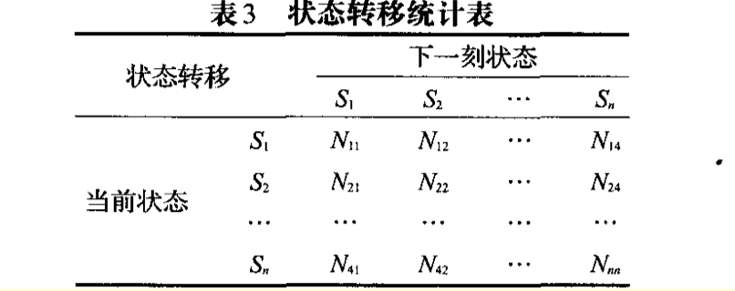
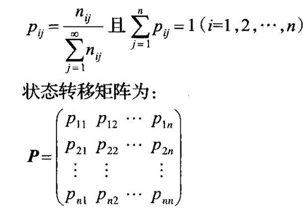
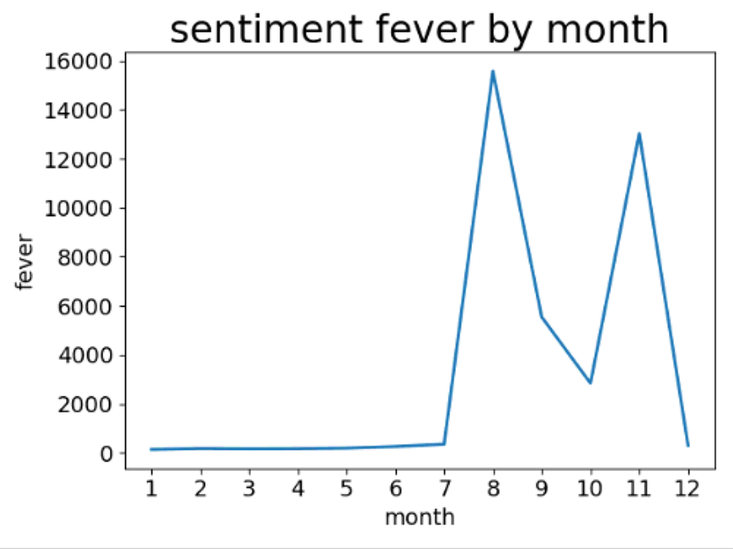
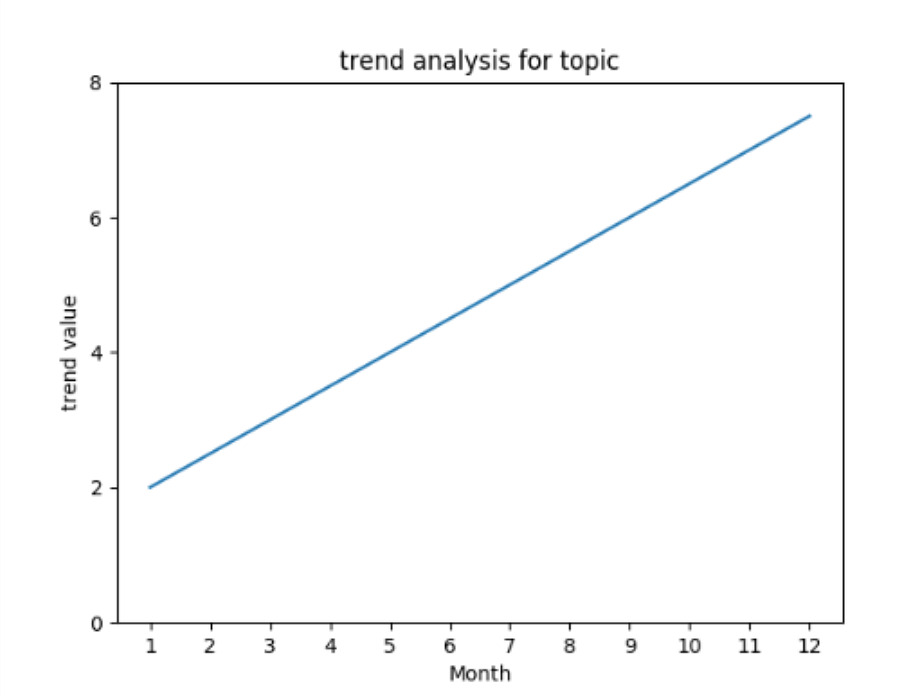

# 周报-第5周-余连玮

## 本周完成的事情

### 一、爬取主题相关的微博数据

我们从提取出的45个主题中选择了“非洲猪瘟”这个具有代表性的主题。利用微博的高级搜索，对“非洲猪瘟”按时间搜索，并爬取2018整年的推文数据。（由王子昂和我共同完成）

由于微博需要登录才能查看更多信息，因此需要利用selenium模拟浏览器登录。具体步骤如下：

1. 登陆微博
2. 跳转到搜索页面
3. 按月份搜索“非洲猪瘟”，迭代时间为一次搜索一天
4. 一页一页的爬取数据。

由于微博搜索最多只能显示50页的数据，因此当某些月份推文较多时，需要更加细化迭代时间，一次搜索6小时或者2小时。

### 二、进行趋势分析

复现论文《基于马尔可夫链的舆情热度趋势分析》中的趋势分析方法：

1. 计算舆情热度：热度由新闻、微博(推文数、回复数、转发数、喜欢数)、论坛(发帖数、回复数)等按照重要程度加权得到。（这部分由王子昂负责）

2. 计算趋势值：根据热度值$H=[H_1, H_2, ..., H_n]$，求出每个热度值的趋势值：$\hat H_i = \hat H_{i+1} - \hat H_i$。可得到热度趋势值$\hat H=[\hat H_1, \hat H_2, ..., \hat H_n]$。

3. 获得状态区间：
   $$
   S_{1}=\left[\overline{H}_{\max / 2}, \overline{H}_{\max }\right]; \\ S_{2}=\left[0, \overline{H}_{\max/2}\right] ; \\S_{3}=\left[\overline{H}_{\min/2}, 0\right] ; \\S_{4}=\left[\overline{H}_{\min }, \overline{H}_{\min/2}\right].
   $$
   
4. 构造状态转移表：统计趋势值从当前状态到下一刻状态的数目来构建状态转移表。

5. 构造状态转移矩阵：利用上一步的状态转移表，进一步构建状态转移矩阵。

6. 热度趋势预测：根据公式 $\pi(n) = \pi(n-1) * P = \pi(0)*P^n$  由状态矩阵求得不同时期的状态向量，以此来表示状态概率。得到的状态向量，每一维表示对应的状态的概率，取概率最大的状态作为预测的当前状态。

7. 将求得的各状态用一定的斜率表示其变化趋势，然后以此画出直观的趋势走向图。

#### 最终结果

1. 热度图：

   

   从热度值的变化可看出，8月和11月热度值很高，推测有大事发生，猜测可能在8月、11月出现过非洲猪瘟的疫情。

2. 趋势图：

   

   这个趋势图结果很不理性，所有月份的状态都是S2(缓慢上升)，可见推测结果不准确。推测有几个原因：首先，基数太小，12个月数量太少了，导致在构造状态转移表时，个别元素值占比很大，最后计算概率转移矩阵时，这个元素对应的概率太大，以此计算的状态向量，很大程度上受这个元素影响，这也就导致我们最终所有月份的状态都是S2；其次，粒度太大，以月份为单位的推测粒度太大，一个月的时间变化很大，无法用前一个月的变化来预测下一个月。

   原论文中是按小时进行的预测，与我们的出入很大。

## 下周需要完成的事情 ##

###  一、改进趋势分析

目前想到两个改进方法：

1. 将预测的粒度调整得小一些，取热度值最高的8月为例进行尝试。算出8月整月31天的热度值，对其进行预测，看是否能得到较好的效果。
2. 换一种趋势预测的方法再次尝试。

### 二、实训收尾工作

整理项目代码、完成系统的可视化效果、完成实训总结报告、ppt、视频。