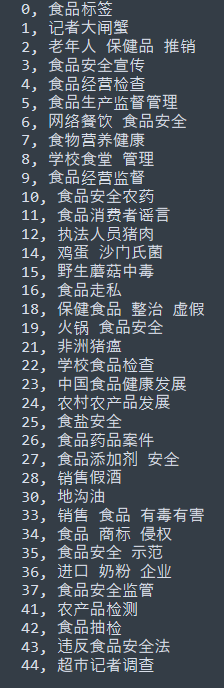
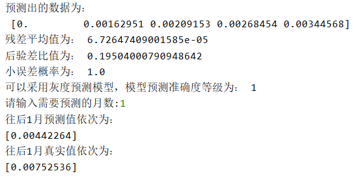
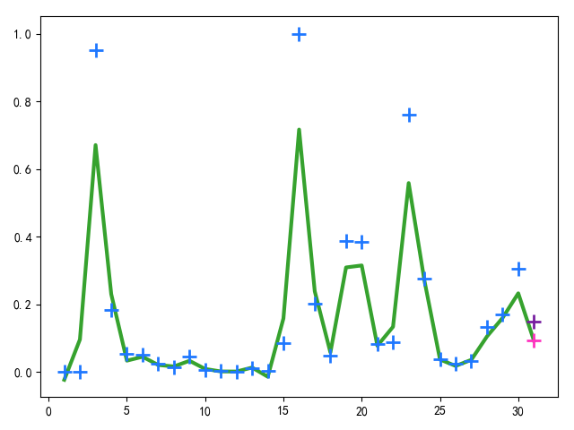
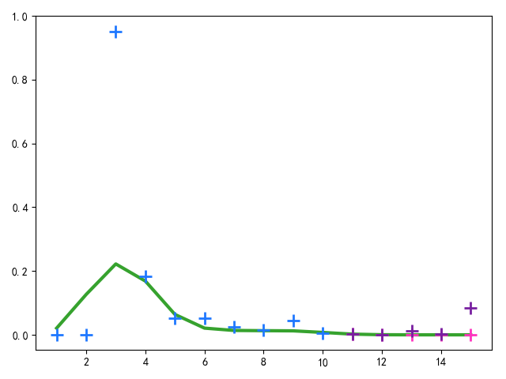
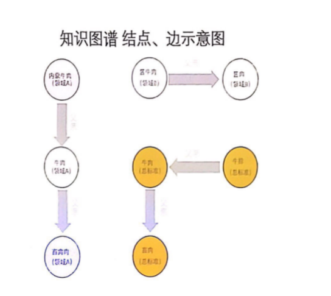
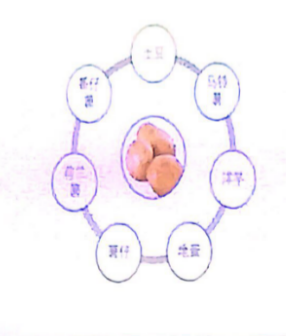
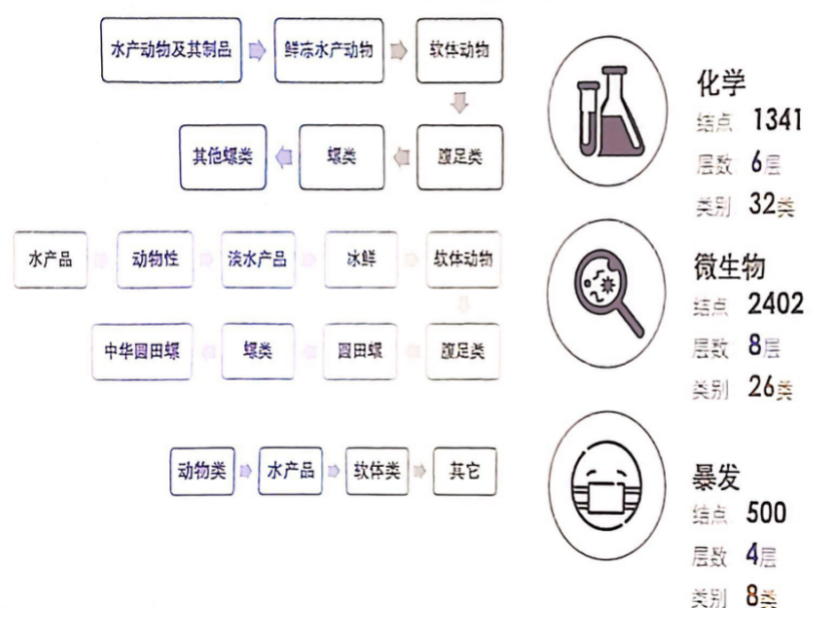
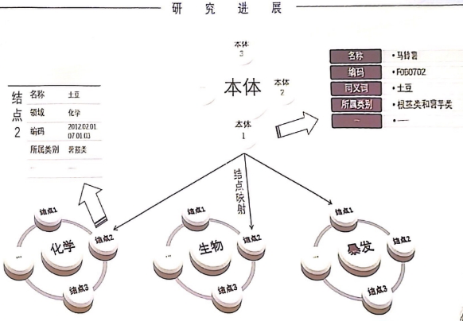
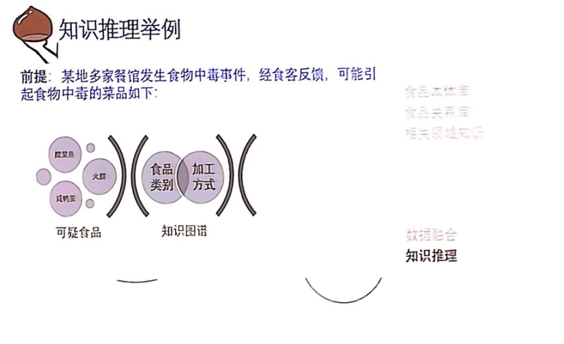
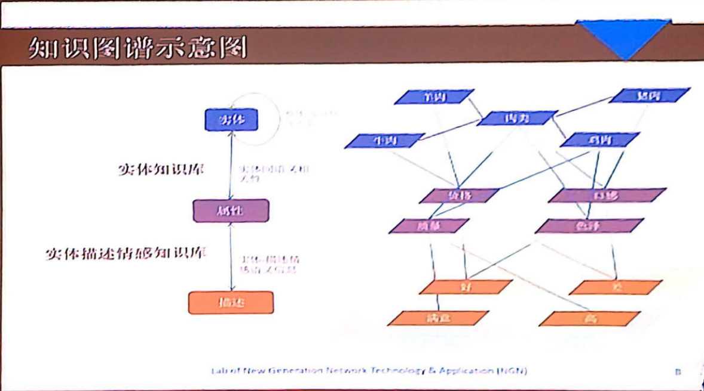

# 第6周周报——王子昂 #

## 得到各个月热度排行榜 ##

> 以8月为例，爬取各个话题2018年的微博信息，得到微博数、转发数、评论数、点赞数

* 所有的话题id编号及关键词如下：

* 按照上周周报中提到的方法，计算各个话题的热度
* 按照热度值排序，得到热度排行榜

## 热度趋势预测 ##

### 灰色预测 ###

微博话题的强度受到社会环境和个人环境等各个因素的影响，可以将其认为是一个无规律可循的灰色系统，尝试采用灰色模型 GM(1,1,) 对其情感进行变化进行预测，预测模型过程如下：

1. 设微博话题情感时间序列为 $x^{0}=\left\{x^{0}(1), x^{0}(2)\right.,\cdots, x^{0}(n) \}$，由于微博情感的随机程度较大，我们将原始情感时间序列进行累加处理，以增加数据的平稳性，累加后的话题情感时间序列为$x^{1}=\left\{x^{1}(1), x^{1}(2), \cdots, x^{1}(n)\right\}$，其中$x^{1}(n)=\sum_{i=1}^{n} x^{(0)}(n)$

2. 用微分方程近似地描述微博情感新的时间序列变化趋势，其计算公式为：
   $$
   \frac{\mathrm{d} x^{(1)}(t)}{\mathrm{d} t}+a x^{(1)}(t)=u
   $$

3. 参数a，u通过最小二乘法拟合获得，其拟合公式为：
   $$
   \left(\begin{array}{l}{a} \\ {u}\end{array}\right)=\left(B^{T} B\right)^{-i} B^{T} Y_{n}
   $$

   * 其中 $Y_n$ 为原始微博情感序列，其值为$Y_{n}=\left[x^{(0)}(2), x^{0}\right.(3), \cdots, x^{0}(n) ]^{T}$，B为构造微博情感数据矩阵，其值为：
     $$
     B=\left[\begin{array}{ccc}{-\frac{1}{2}\left[x^{\prime}(1)+x^{1}(2)\right]} & {1} \\ {-\frac{1}{2}\left[x^{\prime}(1)+x^{1}(2)\right]} & {1} \\ {\vdots} & {} \\ {-\frac{1}{2}\left[x^{1}(1)+x^{1}(2)\right]} & {1}\end{array}\right]
     $$

4. 将获取的a和w的值代入微分方程，得到微博情感累加随时间变化的函数，其变化函数为：
   $$
   x^{1}(t+1)=\left[x^{(0)}(1)-\frac{u}{a}\right] e^{-\alpha t}+\frac{u}{a}
   $$

5. 根据微博情感累加值，计算微博第t+1时刻的情感预测值，计算方式如下：
   $$
   x^{(0)}(t+1)=x^{1}(t+1)-x^{1}(t)
   $$

#### 预测结果及分析 ####

* 相比较传统统计学方法其预测结果的精确度有一定的提高。
* 灰色模型对随机波动性较大的数据预测效果较差，不宜使用灰色预测法

### GPR ###

> 高斯过程回归（Gaussian Process Regression，GPR）是一种基于贝叶斯网络的机器学习算法，不仅具有贝叶斯网络推理能力，可解释性强，同时具有了支持向量机的小样本、非线性、高维等问题的自适应处理能力，大量研究实践表明，相对于支持向量机和神经网络，GPR模型具有易实现、泛化能力更强等优点，可以获得较好的建模性能

#### 高斯过程回归模型 ####

给定训练集$D :\left\{\boldsymbol{X}_{i}, t_{i}\right\}_{i=1}^{N}$，N为训练样本数，$X_i$为对应$t_i$时刻的向量，高斯过程的随机变量联合概率分布函数为：
$$
P\left(t | C\left(X_{m}, X_{n} ; \Theta\right),\left\{X_{n}\right\}\right)=\frac{1}{Z} \exp (-\frac{1}{2}(t-\mu)^{\mathrm{T}}\cdot\\ C\left(\boldsymbol{X}_{m}, \boldsymbol{X}_{n} ; \boldsymbol{\Theta}\right)^{-1}(\boldsymbol{t}-\boldsymbol{\mu}) )
$$

* $X_m$和$X_n$，表示第m和n个向量
* $C\left(X_{m}, X_{n} ; \Theta\right)$为参数协方差函数
* $\mu$为均值向量

协方差函数为：
$$
C\left(X_{m}, X_{n} ; \Theta\right)=\theta_{1} \exp \left(-\frac{1}{2} \sum_{l=1}^{L} \frac{\left(X_{m}^{(l)}-X_{n}^{(l)}\right)^{2}}{\delta^{2}}\right)+\theta_{2}
$$

* L为向量$X_i$中元素个数
* $\delta$为方差
* $\theta_1,\theta_2$为参数

对于一个新输入向量$X_{N+1}$，采用预测模型对其$t_{N+1}$的概率分布、期望和方差进行预测，设模型函数表示形式为：
$$
t_{n}=y\left(\boldsymbol{X}_{n}\right)+v_{n}
$$

* $y\left(\boldsymbol{X}_{n}\right)$是模型函数
* $v_n$是预测误差

模型概率为：
$$
P(T_{N}|\left\{X_{n}\}, A, B\right)=\int P\left(T_{N} |\left\{X_{n}\right\}, y, v\right) P(y | A)\cdot P(v | B) \mathrm{d} y \mathrm{d} v
$$

* $P(y|A)$为 $y(x)$ 的事先概率分布
* A是$P(y|A)$的一组超参数
* $P(v|B)$为预测误差的事先概率分布
* B是表示误差v的参数

令$T_{N}=\left(t_{1}, t_{2}, \cdots, t_{N}\right), T_{N+1}=\left(t_{1}, t_{2}, \cdots, t_{N}, t_{N+1}\right)$,那么$t_{N+1}$条件分布可以采用如下方式进行表示，并通过它对$t_{N+1}$进行预测
$$
P\left(t_{N+1} | D, A, B, X_{N+1}\right)=\frac{P\left(T_{N+1}| \{X_{n}\}, A, B, X_{N+1}\right)}{P\left(T_{N}\left|\left\{X_{n}\}, A, B\right)\right.\right.}
$$
根据贝叶斯法可推断出$t_{N+1}$的分布函数为
$$
P\left(t_{N+1} | D, C\left(X_{n}, X_{m} ; \Theta\right), X_{N+1}, \Theta\right)=\\
\frac{P\left(T_{N+1} | C\left(X_{n}, X_{m} ; \Theta\right), \Theta, X_{N+1},\left\{X_{n}\right\}\right)}{P\left(T_{N}\left|C\left(X_{n}, X_{m} ; \Theta\right), \Theta,\left\{X_{n} \}\right)\right.\right.}
$$
代入高斯分布公式，简化后得：
$$
P\left(t_{N+1} | D, C\left(X_{n}, X_{m} ; \Theta\right), \Theta, X_{N+1}\right)=\frac{1}{Z} \exp \left(-\frac{\left(t_{N+1}-\hat{t}_{N+1}\right)^{2}}{2 \sigma_{\hat{i}_{N+1}}^{2}}\right)
$$

* $\hat{t}_{N+1}$为期望值

根据期望和方差可以进行预测。

#### 预测结果及分析 ####

* 绿色的线表示：`predictive output mean` 预测输出均值，根据该值进行预测，可以看到该值对真实值的拟合还是具有一定准确性的，尤其是热度变化较为稳定的部分。
* 蓝色的点表示：用来训练的真实值
* 粉色的点表示：模型预测的值
* 紫色的点表示：预测的值对应的真实值

> 8月份猪瘟话题，根据前30天的值预测最后一天的热度

> 8月份猪瘟话题，根据前10天的值预测未来五天的热度趋势

* 从图中可以看出预测输出均值对真实热度值得拟合还是比较准确的，对于热度变化不稳定得区域，该模型对热度趋势的预测还是比较准确的，对于热度变化稳定的区域，如图(2)所示，对未来5天的预测基本都是准确的（紫色的真实值与粉色的预测值重合）
* 但由于数据和时间的限制，并没有进行大规模的测试，很难得到该模型的预测准确率，并不能很好的衡量模型的预测效果
* 在GPR的应用中，参数对性能的影响至关重要，目前常采用共扼梯度法确定最优参数，但共扼梯度法存在对初始值敏感、易陷入局最优等弊端，对GPR预测性能产生不利影响，对于舆情热度的预测，可以考虑采用入侵杂草优化(IWO)对参数进行优化。

### 其他预测方法 ###

> 目前对微博舆情趋势预测的研究，主要有基于传统统计学的预测方法和以机器学习为基础的预测方法

基于传统统计学的预测方法，预测方法参数设置少，容易实现但大都是对微博舆情的线性建模，不能够有效体现出微博信息非线性变化的特点，预测结果往往缺乏准确性：

* 基于时间序列的预测方法
* 采用马尔科夫链的方法建立模型对舆情热度趋势进行预测
* 利用指数平滑法对微博舆情未来发展趋势进行预测

以机器学习为基础的预测方法，主要是利用机器学习中的逻辑回归模型建立基于行为预测的微博信息传播模型，相比较传统统计学方法其预测结果的精确度有一定的提高，但逻辑回归模型的自变量间存在的多重共线性会影响预测结果的准确性，神经网络方法的网络结构复杂且存在易出现过度拟合的缺陷：

* 基于神经网络结合遗传算法和模拟退火算法的微博舆情趋势预测方法

## 听取清华讲座总结PPT ##

清华食品安全推进会主要讲了三大部分：

1. 大规模食品安全知识图谱的构建
2. 云链融合机制下的食品安全大数据平台
3. 食品安全网络舆情的情感分析

### 食品安全事件感知和分析 ###

> 食品安全事件采集、抽取、融合

* 通过主题爬虫采集食品安全相关的非结构化文本信息
  * 针对各大搜索引擎接口进行源搜索，人工标识所需的主题文本
  * 通过机器学习得到主题，以此来支撑主题分类器
  * 主题分类器爬取主题数据
* 对信息进行预处理、清洗、去噪
* 按照事件模型抽取事件的要素，构建食品安全事件库（通过OWL事件模型来描述食品安全事件）
* 在事件库的支撑下，对食品安全事件进行分析
* 事件关系识别：通过哈工大的知识图谱，能够挖掘事件产生的根源，事件和事件之间的事件流关系，为事件的态势分析和预测提供支撑

#### 应用及启发 ####

关于数据获取的方式，我们采用的是首先爬取各大网站的新闻信息，通过LDA进行主题提取，这样做的优势是人工参与少，但问题也很明显，由于并不是从根源获取数据，所以难免有因为数据源不全而导致漏爬，通过搜索爬取又难免因为关键词的选择，导致获取的数据有所偏向。讲座中提到针对各大搜索引擎进行源搜索，可能得到的数据会更加全面，但需要人工对相关数据进行标注，需要更大的人力投入。

关于事件提取部分，我们目前主要通过文档的时间、地点、人物、食品安全专有名词来进行事件的抽取，但在食品安全专有名词的定义方面，更多是根据主观推测，在标注数据的过程中难免出现漏标、标注标准不一的问题，结合讲座的内容，我觉得通过OWL事件模型包括的各个方面，利用已有的数据集对事件提取的准确率可能会更高。同时还可以结合知识图谱等相关技术，进一步挖掘事件产生的根源以及事件和事件之间的关系，对于之后的趋势分析会有更好的支撑。

### 知识图谱 ###

这部分内容与我们当前做的项目相关性最大。

- 知识图谱的必要性：
  - 整合信息
  - 关联内容
  - 理解语义
  - 挖掘知识

#### 现实痛点 ####

1. 食品安全数据类型多，不仅有结构化、也有非结构化数据。
2. 各行业食品分类标准不兼容：如化学污染物食品分类、微生物食品分类、暴发食品分类。
3. 食品安全涉及多个领域，不同领域之间信息不互通。
4. 食品本体名字繁多，语义上不互通。

#### 解决办法 ####

建立食品安全知识图谱，期望做到：

1. 知识规模在十万级节点、百万边。知识图谱只有足够大足够全才能起到类似于百科的作用。
2. 解决多源异构食品安全数据库系统的互联互通和语义融合问题，打通了不同领域的信息。
3. 以节点和边存储知识，最终得到的是结构化的数据，便于后续的处理和应用。
4. 支撑食品安全事件推理和态势预测。

#### 关键技术 ####

1. 本体库构建：制定标准、构建食品同义词库
   - 如土豆、马铃薯、洋芋、薯仔属于同一本体，单纯从名字无法知道它们属于同一本体，但是当建立起本体库后，就能得到这些名词都指向同一本体。
   - 分多个领域，本体可映射到不同领域的节点上
2. 通用标准建立：卫健委三系统映射、映射标注系统
3. 多源异构数据融合：跨领域数据采集、图谱融合、基于知识图谱的简单分析
4. 知识图谱构建及应用

知识图谱结点、边示意图：

##### 本体库构建 #####

标准制定：

- 为食品及属性设置节点，用食品码和属性码唯一标示。
- “食品码+属性码”：解决复杂食品难以表达的问题，为数据融合共享提供基础

食品同义词库：

- 解决多词一义

##### 通用标准建立 #####

卫健委三系统映射：

- 整个图谱分为三个领域/系统：化学、生物、暴发。

  

- 本体库中的本体能能够映射到三个领域的节点，包含详细节点的信息。

  

映射标注系统：

为建立映射，需要进行标注，有以下两种方式。

- 自动映射
  - 计算相似度
  - 提供候选食品、属性
- 辅助人工标注
  - 搜索候选
  - 自动编码
  - 多用户协同

#### 应用及启发 ####

1. 知识推理，讲座中提到的应用。

2. **对于我们项目的应用**：用于命名实体提取，基于知识的实体提取比单纯的基于上下文训练的模型提取的结果肯定效果好不少。在提取实体的基础上，能够利用上述说的知识推理，了解到文本中提到的食品主体、类别、加工方式、以及相关领域的知识，为后续进行文本分析和事件分析提供很大的帮助。如：将描述同一种食品的事件集合在一起分析、将包含同种加工方式的事件集合在一起分析……

### 云链融合的大数据平台 ###

这部分主要涉及大数据的存储及管理部分，由于与我们的项目关联性不大，大致了解了一些：

- 云：指利用云平台存储数据。
- 链：指利用区块链技术，解决云平台自身的可信性问题以及开放网络环境下云环境面临的安全威胁，对食品安全大数据进行保护。

#### 主要架构 ####

- 数据流：客户端-云
- 元数据流
  - 区块链网络
  - 区块链-云
- 云：存储大数据
- 客户端：提交区块链交易、与云平台交互数据操作
- 节点：保存区块链账本、运行智能合约
- 排序节点：运行区块链共识机制
- MSP：对区块链节点做成员管理和权限控制

### 情感分析 ###

这部分主要涉及舆情的情感分析部分：

1. 应用场景：商情调查、民情感知、行情挖掘、舆情分析
2. 情感信息：情感分类、意见挖掘、观点识别
3. 文本情感特征：情感计算
4. 数据源：商品评论、社交媒体
5. 情感信息：极性、评价对象

- 利用知识图谱，可以做到结构化知识的持续性学习：
  - 领域信息
  - 针对食品安全领域的情感表达
  - 在食品安全领域的关键评价对象
  - 引导模型更精准的情感识别
  - 生成结构化的分析结果

- 针对特定对象的细粒度情感抽取系统：
  - 文本\=\==> 二元情感分析系统 ===>结构化情感分析结果
  - 其中，二元情感分析系统包括：实体知识库、实体描述情感知识库

- 知识图谱示意图：

- 应用系统：
  - 输入：非结构化语料、实体知识、情感关系
  - 系统：预处理、语法结构、抽取、诊断
  - 输出：结构化分析结果