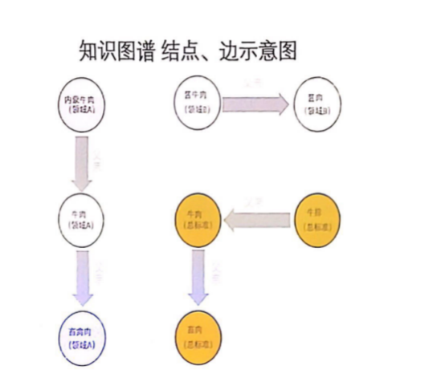

# 周报-第6周-余连玮

## 本周完成的事情

### 一、总结趋势分析失败原因

- 首先我在上周失败的基础上进行了改进：将预测的粒度调整得小一些，取热度值最高的8月为例进行尝试。算出8月整月31天的热度值，对其进行预测。但是效果仍然不是很理想，无法正确预测出走势。

- 而后我查阅了一些利用马尔可夫链进行预测的论文，发现：采用马尔科夫链的方法建立模型属于传统统计学的预测方法，这些基于传统统计学的预测方法参数设置少，容易实现但大都是对舆情的线性建模，不能够有效体现出信息非线性变化的特点，预测结果往往缺乏准确性。因此只能预测舆情状态趋于稳定后的状态，而对于热度急剧变化的突发事件则难以预测，这样即使预测是正确的，也没有很大的作用。因此最终否定了这个方法。
- 后续又试想用神经网络结合遗传算法和模拟退火算法进行趋势预测，但是发现我们数据量较小，训练效果不好，同时神经网络方法的网络结构复杂且存在易出现过度拟合的缺陷，因此最终放弃了这个方法。
- 最后利用高斯过程回归模型(GPR)实现了趋势分析，这部分由王子昂完成。

### 二、绘制事件分布热度图

利用在前面命名实体识别得到的地名，统计所有事件发生的省份，来得到根据地点的热度分布。

具体步骤如下：

#### 1. 获得省份信息

- 每个事件选取第一个文档作为代表，找到对应文档的实体文件，获取其中的地点实体。然后利用库cpca，根据地点获取对应的省份信息。

主题0的事件分布如下：

#### 2. 绘制热度图

利用pyecharts库绘制中国地图及各省份热度。

- 为每个主题分别绘制热度图：首先调用get_location函数获得每个话题的省份数据，再调用create_map_core函数添加数据到地图中，最后调用render函数渲染地图，真正绘制到html文件中。最后将所有主题的省份数据存储在文件中，供后续绘制包含所有主题数据的热度图使用。
  - 下图为主题21的“事件地区分布热度图”：
- 绘制包含所有主题数据的热度图：从上述存储的文件中读入所有主题的省份数据，设置好地图的样式，添加所有主题的省份数据，绘制一张地图。
  - 下图为所有主题综合的“事件地区分布热度图”：

## 听取清华讲座及整理ppt

清华食品安全推进会主要讲了三大部分：

1. 食品安全事件感知和分析
2. 大规模食品安全知识图谱的构建。
3. 云链融合机制下的食品安全大数据平台
4. 食品安全网络舆情的情感分析

### 1. 食品安全事件感知和分析

> 食品安全事件采集、抽取、融合

- 通过主题爬虫采集食品安全相关的非结构化文本信息
  - 针对各大搜索引擎接口进行源搜索，人工标识所需的主题文本
  - 通过机器学习得到主题，以此来支撑主题分类器
  - 主题分类器爬取主题数据
- 对信息进行预处理、清洗、去噪
- 按照事件模型抽取事件的要素，构建食品安全事件库（通过OWL事件模型来描述食品安全事件）
- 在事件库的支撑下，对食品安全事件进行分析
- 事件关系识别：通过哈工大的知识图谱，能够挖掘事件产生的根源，事件和事件之间的事件流关系，为事件的态势分析和预测提供支撑

#### 应用及启发

关于数据获取的方式，我们采用的是首先爬取各大网站的新闻信息，通过LDA进行主题提取，这样做的优势是人工参与少，但问题也很明显，由于并不是从根源获取数据，所以难免有因为数据源不全而导致漏爬，通过搜索爬取又难免因为关键词的选择，导致获取的数据有所偏向。讲座中提到针对各大搜索引擎进行源搜索，可能得到的数据会更加全面，但需要人工对相关数据进行标注，需要更大的人力投入。

关于事件提取部分，我们目前主要通过文档的时间、地点、人物、食品安全专有名词来进行事件的抽取，但在食品安全专有名词的定义方面，更多是根据主观推测，在标注数据的过程中难免出现漏标、标注标准不一的问题，结合讲座的内容，我觉得通过OWL事件模型包括的各个方面，利用已有的数据集对事件提取的准确率可能会更高。同时还可以结合知识图谱等相关技术，进一步挖掘事件产生的根源以及事件和事件之间的关系，对于之后的趋势分析会有更好的支撑。

### 2. 知识图谱

这部分内容与我们当前做的项目相关性最大。

- 知识图谱的必要性：
  - 整合信息
  - 关联内容
  - 理解语义
  - 挖掘知识

#### 现实痛点

1. 食品安全数据类型多，不仅有结构化、也有非结构化数据。
2. 食品安全涉及多个领域，不同领域之间信息不互通。
3. 食品本体名字繁多，语义上不互通。

#### 解决办法

建立食品安全知识图谱，期望做到：

1. 知识规模在十万级节点、百万边。知识图谱只有足够大足够全才能起到类似于百科的作用。
2. 解决多源异构食品安全数据库系统的互联互通和语义融合问题，打通了不同领域的信息。
3. 以节点和边存储知识，最终得到的是结构化的数据，便于后续的处理和应用。
4. 支撑食品安全事件推理和态势预测。

#### 关键技术

1. 本体库构建：制定标准、构建食品同义词库
   - 如土豆、马铃薯、洋芋、薯仔属于同一本体，单纯从名字无法知道它们属于同一本体，但是当建立起本体库后，就能得到这些名词都指向同一本体。
   - 分多个领域，本体可映射到不同领域的节点上
2.  通用标准建立：卫健委三系统映射、映射标注系统
3. 多源异构数据融合：跨领域数据采集、图谱融合、基于知识图谱的简单分析
4. 知识图谱构建及应用

知识图谱结点、边示意图：

##### 本体库构建

标准制定：

- 为食品及属性设置节点，用食品码和属性码唯一标示。
- “食品码+属性码”：解决复杂食品难以表达的问题，为数据融合共享提供基础

食品同义词库：

- 解决多词一义

##### 通用标准建立

卫健委三系统映射：

- 整个图谱分为三个领域/系统：化学、生物、暴发。

  

- 本体库中的本体能能够映射到三个领域的节点，包含详细节点的信息。

  

映射标注系统：

为建立映射，需要进行标注，有以下两种方式。

- 自动映射
  - 计算相似度
  - 提供候选食品、属性
- 辅助人工标注
  - 搜索候选
  - 自动编码
  - 多用户协同

#### 应用及启发

1. 知识推理，讲座中提到的应用。

2. **对于我们项目的应用**：用于命名实体提取，基于知识的实体提取比单纯的基于上下文训练的模型提取的结果肯定效果好不少。在提取实体的基础上，能够利用上述说的知识推理，了解到文本中提到的食品主体、类别、加工方式、以及相关领域的知识，为后续进行文本分析和事件分析提供很大的帮助。如：将描述同一种食品的事件集合在一起分析、将包含同种加工方式的事件集合在一起分析……

### 3. 云链融合的大数据平台

这部分主要涉及大数据的存储及管理部分，由于与我们的项目关联性不大，大致了解了一些：

- 云：指利用云平台存储数据。
- 链：指利用区块链技术，解决云平台自身的可信性问题以及开放网络环境下云环境面临的安全威胁，对食品安全大数据进行保护。

#### 主要架构

- 数据流：客户端-云
- 元数据流
  - 区块链网络
  - 区块链-云
- 云：存储大数据
- 客户端：提交区块链交易、与云平台交互数据操作
- 节点：保存区块链账本、运行智能合约
- 排序节点：运行区块链共识机制
- MSP：对区块链节点做成员管理和权限控制

### 4. 情感分析

这部分主要涉及舆情的情感分析部分：

1. 应用场景：商情调查、民情感知、行情挖掘、舆情分析
2. 情感信息：情感分类、意见挖掘、观点识别
3. 文本情感特征：情感计算
4. 数据源：商品评论、社交媒体
5. 情感信息：极性、评价对象

- 利用知识图谱，可以做到结构化知识的持续性学习：
  - 领域信息
  - 针对食品安全领域的情感表达
  - 在食品安全领域的关键评价对象
  - 引导模型更精准的情感识别
  - 生成结构化的分析结果

- 针对特定对象的细粒度情感抽取系统：
  - 文本\=\==> 二元情感分析系统 ===>结构化情感分析结果
  - 其中，二元情感分析系统包括：实体知识库、实体描述情感知识库

- 知识图谱示意图：

- 应用系统：
  - 输入：非结构化语料、实体知识、情感关系
  - 系统：预处理、语法结构、抽取、诊断
  - 输出：结构化分析结果