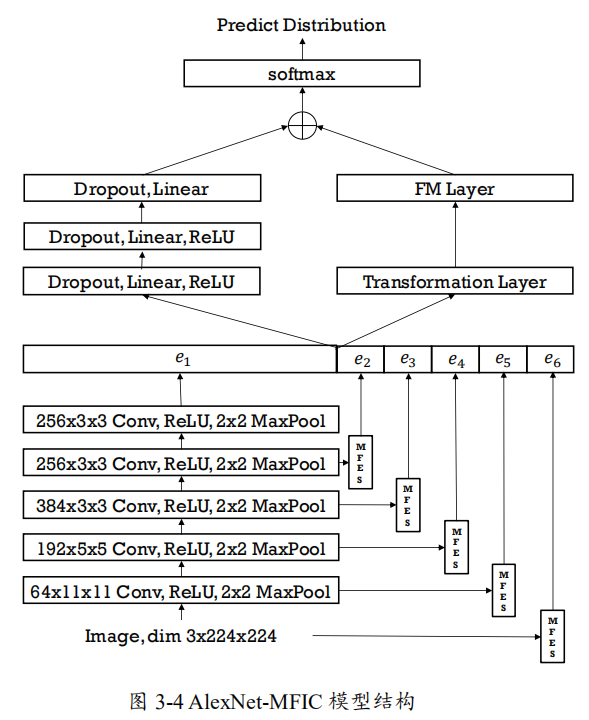
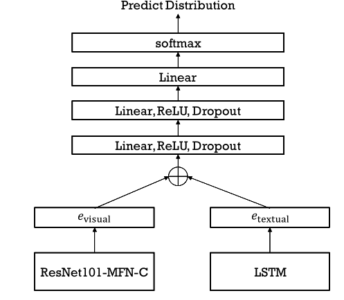
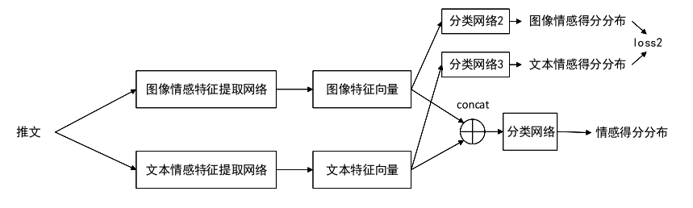

# 第一周周报——王子昂 #

## 本周完成的工作 ##

### 阅读《基于网络数据的食品安全事件检测与分析》梳理论文中解决问题的思路以及用到的技术 ###

#### 食品安全事件检测 ####

* 将爬虫获得的新闻数据进行预处理后进行文本向量化
* 利用训练好的分类算法模型判别该数据是否属于食品安全相关数据
* 对于属于食品安全的相关数据，要使用 LDA 主题模型利用Gibbs 采样预测其主题
  - 若主题已存在，则将该文档加入已有主题中
  - 否则，生成一个新主题，并在主题中创建新事件
* 特征提取（命名实体识别）：利用训练好的BiLSTM-CRF 模型识别出与食品安全相关的新闻数据中人名或机构名、地名、时间以及食品安全专有名词
* 相似度计算：利用文本中的食品安全专有名词和文本数据进行相似度计算
* 如果相似度小于阈值，将新闻归入已有的事件；若大于则在主题中创建新事件

#### 食品安全事件情感分析 ####

* 结合食品安全现有语料库以及爬取文本建立的相关语料库
* 基于词向量和 TextCNN（文本卷积神经网络）进行情感倾向分析

### 阅读《社交网络推文情感分类系统》梳理论文中解决问题的思路以及用到的技术 ###

#### 对多级图像特征进行交叉组合的神经网络结构 ####

* 具有三种结构的多级特征提取器 MFES：将输入图像和每一个卷积层的输出特征图分别输入一个 MFES，MFES 会分别生成一个一维向量，将这些输出的向量(即 e2，e3，e4，e5，e6)与原卷积神经网络的输出向量 e1 拼接，作为全连接神经网络的输入特征

  

* 多级特征交叉分类器 MFIC：利用 FM 模型显式地引入交叉特征，以增强分类器的表达能力，提高分类准确率

  

#### 图像情感分类模型训练算法 ####

* 自动标注算法 TIS：使用文本图像情感模型对文本内容情感进行预测，结合文本情感概率得分和图像情感概率得分，最终确定该图像是否能通过筛选录入数据集，以及录入图像的标签
* 图像去重算法 CH：将公开、弱标注数据集中图片转换为Histogram特征向量，通过计算向量间的距离，判断图像是否重复

#### 图像文本联合情感分类算法 ####

* 图像文本混合网络（VTFN）：利用ResNet101-MFN-C 图像情感分类网络的卷积神经网络部分提取图像情感特征向量，利用LSTM 神经网络提取文本特征向量，将两个向量拼接为一个向量，送入分类器

  

* 引入相关性损失函数：计算分类器的输出与样本类别之间的交叉熵，对文本情感类别和图像情感类别的概率分布求交叉熵，将两部分结合形成最后的损失函数

  

### 梳理食品安全事件检测与分析技术框架 ###

* 梳理《网络评论文本的细粒度情感分析研究》、《食品安全网络公开数据采集技术研究》、《文本话题识别算法的研究与实现》、《社交网络推文情感分类系统》、《基于网络数据的食品安全事件检测与分析》论文中针对食品安全事件检测和分析所能用到的技术，整理整体实现——具体内容见“食品安全事件检测与情感分析技术总结”
* 将上述论文的技术整合到一个框架，制定今后的研究方向——具体内容见“食品安全事件检测与情感分析框架”

* 基于制定的研究方向，确定未来五周具体的实训计划及分工

## 下一周的计划 ##

* 配置环境，整理命名实体识别代码（标注、识别）、话题提取部分、事件检测部分的代码，理解代码结构和实现方式
* 由于代码结构较为杂乱，有很多重复无用的代码，基于源代码的基础上进行代码的重构，添加必要注释，修改其中存在的问题，使整体结构清晰，代码易于重用