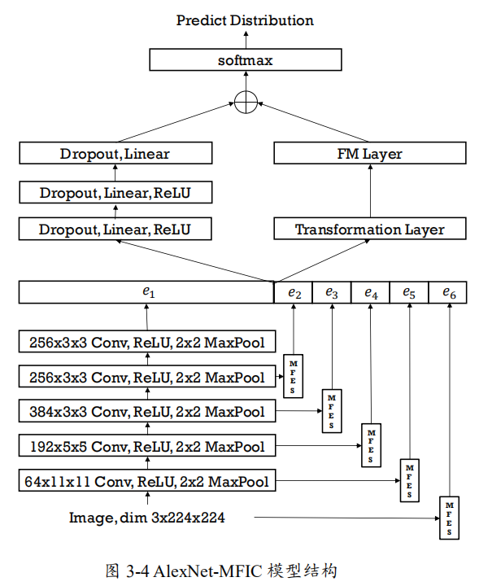

# 技术框架总结 #

## 爬取数据 ##

* 新闻文本：人民日报、搜狐新闻、澎湃新闻、腾讯新闻、食品伙伴网
* 新闻音频：蜻蜓FM、喜马拉雅 ==来源可以修改==
* 新闻视频：央视网

## 数据处理 ##

### 文本处理 ###

- 数据清洗：删除带有杂质、重复的数据
- 中文分词
  * 使用 pkuseg 分词工具进行分词（分词准确率高、可支持不同领域的分词）
  * Jieba分词（文晴曼）
  * 采用 NLPIR 分词系统（细粒度）：用户词典功能，将识别出的新词添加到用户词典
- 去除停用词
  * 综合四川大学机器智能实验室停用词表、哈工大停用词表等
  * 百度停用词表（文晴曼）
- 特征选择和提取 ==针对数据稀疏、内聚性差的数据==
  * （文晴曼）：利用TextRank算法选择重要性较高的词语，构建**主题词典**，利用TextRank算法提取每个文本的前 top-K 个关键词，再从这些关键词集合中选择出现次数最多的前 top-N 个词语，组合这些词语形成主题词典
  * （文本话题识别）：TF-IDF算法选取值最高的K个关键词，作为文档关键词

### 音频处理 ###

- Python 的 imageio 库对各种图像数据进行读取和写入操作
- 利用 ffmpeg 批量转化音频格式（pcm、wav、amr）
- 百度语音识别API将音频转换为文字

### 视频处理 ###

* Python 的 imageio 库对各种图像数据进行读取和写入操作
* 利用 ffmpeg 进行解码视频文件
* 利用**百度文字识别**工具对视频中的文字进行识别 ==可能不需要==

## 文本向量化 ##

- 使用神经网络模型中 word2vec 模型训练词向量
- 利用训练好的 word2vec 模型将输入的词语转化为词向量表示
- 将词向量按照文本顺序拼装，生成词向量矩阵
- 利用人民日报中文语料库，使用 gensim 中 word2vec 学习词向量
- 去除同义词==（文本话题识别）==：准备完备的同义词表，利用 Wikipedia 语料库训练 word2vec 模型用于对多义同义词归并进行确定

## 文本过滤 ##

### 利用支持向量机 SVM ###

> 对文本预处理后的文档进行分类，过滤掉与食品安全无关的文本

- 人工标记数据集
  - 与食品安全相关：主题爬虫爬取和食品安全相关的新闻
  - 与食品安全无关：爬取与娱乐、体育相关的新闻数据
  - 按 7:3 划分训练集和测试集
- 将训练集输入训练分类器模型，测试集输入用来评估整个模型效果
  - 评价指标：混淆矩阵
- 对新闻文档进行判别，过滤掉与食品安全无关的文档

## 主题提取 ##

### LDA主题提取 ###

> 给定一篇文档，通过训练好的 LDA 模型预测出该食品安全相关文档所隐藏的主题词集合

- 确定最优主题数T
  * 利用困惑度（使困惑度最小）
  * 利用贝叶斯统计标准方法
- 将构建的最优模型存储在文件中
- 新文档需要确定主题时，加载已保存的主题模型，预测文档的主题分布

### LDA+VSM建模 ###

1. 读取语料文件，根据 gensim 库生成语料模型；
2. 生成 LDA 模型、VSM 模型并保存模型文件；
3. 使用两个模型对语料进行转换，转换为多维向量，其中 VSM 模型通过TFIDF 算法将文档转换为多维 VSM 向量， LDA 模型根据文档-主题的概率分布，生成一个各维相加为 1 的多维 LDA 向量；
4. 根据两种向量分别计算相似度，使用加权值对两个相似度进行整合计算，其中 VSM 向量使用余弦相似度计算向量的相似度，LDA 向量使用 JS 距离的方法计算向量的相似度；
5. 在相似度的基础上进行层次聚类，返回每一个文档对应的类别数。

#### LDA 相似度计算 ####

> JS 距离

$$
\mathrm{D}_{j s}(p, q)=\frac{1}{2}\left[D_{K L}\left(p, \frac{p+q}{2}\right)+D_{K L}\left(q, \frac{p+q}{2}\right)\right]$
$$

#### VSM相似度计算 ####

> 余弦相似度

* TF-IDF：特征项加权
* 余弦定理衡量相似度

## 事件提取 ##

#### 特征项提取 ####

> 提取新闻文档中食品安全专有名词、标记食品安全名词、人名、地名、机构名

- 采用BiSLTM-CRF模型对句子进行标注
  - PER（人名）、LOC（地名）、FOOD（食品安全专有名词）、ORG（机构名）

- 将训练好的模型存储

#### 文本相似度计算 ####

> 计算新文档与事件的相似度，用来判断该文档是否属于新事件

$$
\operatorname{Sim}\left(N_{1}, N_{2}\right)=\theta_{1} \operatorname{Sim}\left(x_{1}, x_{2}\right)+\theta_{2}\operatorname{Sim}\left(y_{1}, y_{2}\right)\\
\operatorname{Sim}(X, Y)=0.5+0.5 * \cos (X, Y)\\
\cos (\mathrm{X}, \mathrm{Y})=\frac{\sum_{i=1}^{n}\left(x_{i} y_{i}\right)}{\sqrt{\sum_{i=1}^{n} x_{i}^{2}} \times \sqrt{\sum_{i=1}^{n} y_{i}^{2}}}
$$

N：文本数据；x：食品专有名词向量；y：文本数据向量

- 若相似度小于阈值，则新增一个事件
- 若相似度大于阈值，则归为该事件之中

## 情感分析 ##

### 文本卷积神经网络 ###

- 结合食品安全现有语料库以及爬取文本建立的相关语料库
- 基于词向量和 TextCNN（文本卷积神经网络）进行情感倾向分析

#### 词向量构建模块 ####

- 数据处理：数据清洗、中文分词、停用词
- 采用 word2vec 模型中的 skip-gram 模型进行训练
  - 输入N维的one-hot向量
  - 隐含层的权重矩阵：词向量

#### 分类器模块 ####

> 文本卷积神经网络

- 输入层：输入词向量（文本序列中各词汇的词向量表示）
- 卷积层
  - 输入文本中各词对应的词向量矩阵
  - 窗口值：相邻该词前后N词的信息
- 池化层：最大值池化
  - 结合卷积层进行特征提取
  - 提取的特征值组成特征图
- 全连接层：类似于分类器，经过softmax激活函数，得到分类结果xili

### 图像文本联合情感分类 ###

#### 图像情感分类 ####

> MFES：多级特征提取器

* 将输入图像和每一个卷积层的输出特征图分别输入一个 MFES，MFES 会分别生成一个一维向量，将这些输出的向量(即 e2，e3，e4，e5，e6)与原卷积神经网络的输出向量 e1 拼接，作为全连接神经网络的输入特征

> MFIC：多级特征交叉分类器

#### 模型训练方式 ####

* TIS算法：自动标注算法
* CH算法：图像去重算法

#### 图像文本联合情感分类 ####

* 图像文本结合模型：VTFN图像文本混合网络

  

* 相关性损失函数

  

### 细粒度情感分析 ###

