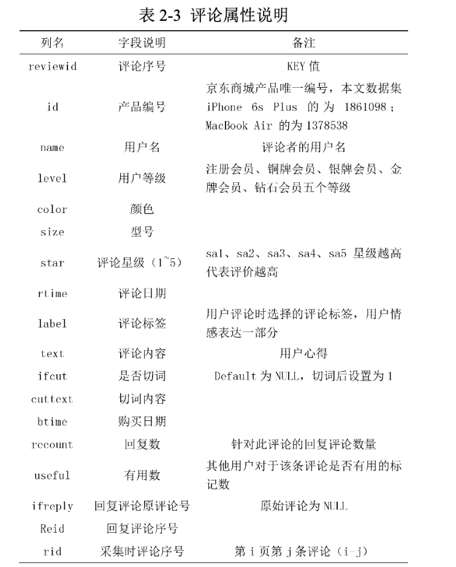

# 论文技术框架

## 网络评论文本的细粒度情感分析研究

### 1.数据采集模块

#### i.网络爬虫

略。

### 2.数据处理模块

#### i.垃圾评论过滤

##### a.构建评论特征

以用户真实评论相关价值元素作为评判依据，构建产品特征词、评论长度、修饰词数量、情感强度的评论特征。

##### b.采用朴素贝叶斯分类器进行分类

论文将垃圾评论识别转换为二元分类问题，根据构建的评论特征构建训练语料集，然后采用朴素贝叶斯分类器对评论文本进行文本分类，对应于 Spam 标记， 垃圾评论标记为 0，真实价值评论标记为为 1。

利用朴素贝叶斯分类器分类识别垃圾评论，定义评论的类别，特征相互独立情况下，先选取部分语料集进行标注，拿来做训练集，训练朴素贝叶斯分类器，估计给定类别先验概率和特征后验概率及权重选择，然后进行测试分类。本章采用朴素贝叶斯算法构建文本分类器，对评论语料集分类之后过滤掉 Spam 标记为 0 的垃圾评论。

##### c.构建评论可信度 Credibility 评估函数??

作者未提及怎么使用。

#### ii.中文分词

采用 NLPIR 分词系统。

##### 用户词典

本文利用 NLPIR 的用户词典功能，将识别出的新词添加到用户词典，并将领域术语类的关键词添加到用户词典，容易切分错误的网络新词也添加入用户词典，在分词过程中出现的切分错误的词语也可手动更改添加到用户词典。

### 3.情感要素抽取模块

#### i.CRFs条件随机场

CRF++主要用于标注数据和切分数据，常见的应用有词性标注、命名实体识别、文本组块分析与信息抽取等。

CRFs 模型的三个关键步骤是特征选取，参数评估（训练）和模型推理（测试）。

##### a. 特征选取

本文选取以下标注特征。尽可能得标注出情感要素信息。

1. 词特征。为了防止特征维数过多，去除无情感表达意义的停用词。
2. 词性特征。所谓词性，是指依据的词的特征来区分词的分类，不同的词性指示不同的情感要素。
3. 上下文信息。上下文信息反应句中词与词之间的句法依赖关系，依赖特征包括词语间和词性直接的相互依赖。

##### b.构建标注集

将标注集设定为四种简单的标记来防止特征稀疏。给定输入序列$W = \{w_i\}$，输出标注序列$Y = {y_t}, y_t  \in \{FO, SO, ADV, P\}$

##### 标注

输入数据为已经预处理后的意群集，通过 CRFs 进行情感要素序列化标注。

#### ii.隐式情感对象识别

用户需要对评论语句进行语义理解，根据评价词和上下文自主推断才能获取的隐式情感对象。

用 F 代表评论句中的情感对象，O 代表评论句中的情感词，组成特征观点对<F,O>，构建训练文档，训练朴素贝叶斯文本分类器，分类识别隐式情感对象，然后采用训练好的分类器完成所有预处理后语料集中评论句的情感要素识别。

### 4.细粒度情感分析模块

#### i.情感歧义搭配词典的构建

##### a.关联规则挖掘

本文针对评论短文本特点，对语料集分词后，以构建的情感歧义词种子词典为中心词，取前后 6 个词与种子词构成一个Item，采用关联规则挖掘方法，在 Transaction 中先发现满足$\alpha$的搭配集，然后在搭配集中识别满足$\beta$的频繁集，$\alpha$和$\beta$的值设定太小剪枝不明显， 设置太大导致搭配集噪音过大，本文实验针对$(\alpha_i,\beta_i)$, 取结果最好的一对参数$\alpha$=0.01%，$\beta$=0.01%。

##### b.挖掘词语间搭配关系强度——点互信息

设定一个阈值δ，过滤掉词语互信息满足$PMI(word_1,word_2)\leδ$的弱关联搭配对。

##### c.构建成词典

经过 PMI 过滤后构成情感歧义词候选搭配集，利用情感词典标注搭配集中评价词语的情感极性， 进而构建成情感歧义词搭配词典， 词条存储形式： <情感对象，情感词，情感倾向性>。在情感倾向性分析时情感歧义词动态极性值的确定需同时满足词语搭配对，解决同一情感词修饰不同情感属性时不同情感倾向的问题。

#### ii.对立观点情感强度计算

##### a.正负向情感强度分析算法

情感倾向计算算法的基本思想：利用情感词和影响情感的情感修饰词计算情感对象情感。算法步骤如下：

1. 根据否定词$n_i$的情感值$Neg_i$ 和程度副词$d_i$的情感值$Mod_i$ ，计算情感修饰词的情感影响因子$Q_{adv_i}$ ：

2. 结合情感词的极性$P_i$计算情感要素组成的属性观点对的情感极性值$Score(f_{t_i})$。 

3. 计算评论语料中产品属性的正向情感强度$Sentiment \left(f_{t_{i}}\right)_{+}$ 和负向情感强度$Sentiment \left(f_{t_{i}}\right)_{-}$。

$$
\text { Sentiment }\left(f_{t_{i}}\right)_{+}=\sum_{j=1}^{c p} w_{j} \text { Score }\left(f_{t_{j}}\right)_{+} \\
\text { Sentiment }\left(f_{t_{i}}\right)_{-}=\sum_{k=1}^{c n} w_{k} S \operatorname{core}\left(f_{t_{k}}\right)_{-}
$$

##### b.对立观点情感摘要

得到各聚合后特征观点对的正向和负向的情感强度之后，可直接由此生成情感摘要，提取前十个热门评价属性，组成<正向情感强度+“的用户认为”+情感对象+情感词>、 <负向情感强度值+“的用户认为”+情感对象+情感词> 形式的包含对立观点的情感摘要，以方便用户直观的了解评论情感强度。

## 食品安全网络公开数据采集技术研究

### 爬虫

- 内容：利用爬虫技术从网络平台上获取食品安全话题下的不同类型数据，这些数据包括文本、音频、视频。

#### Scrapy

python的Scrapy框架。

Scrapy 框架主要是由五个部分构成，包括 Engine(引擎)、Scheduler(调度器)、Downloader(下载器)、Spiders(爬虫主体)和 Pipeline(项目管道)。Scrapy 框架的核心是引擎，它负责处理系统中的数据流，可以用来触发事件。

首先，调度器接收引擎发送给它的 requests 请求，压入调度器中的队列，当引擎再次发送一个请求给它的时候，它将从队列中返回一个请求传递给下载器。

而下载器接收到引擎发送给它的请求之后，将会获取到 response 响应，并将响应发送给爬虫主体 Spiders，爬虫主体在这个步骤中处理响应，并分析数据，从网页中􏰀取数据 Item，并将数据发送给项目管道，并发送下一个requests 请求给引擎，从而进行下一次爬取。

项目管道将会处理接收到的数据，进行数据处理或数据存储的工作。

#### Selenium

Selenium 是用于 Web 应用程序测试的开源自动化测试工具。由于它能通过模拟用户点击浏览器的操作来帮助开发者爬取到反爬机制非常严格的网站，因此在爬虫中也常使用到它。在使用 Selenium 的过程中，我们不考虑具体的请求和响应过程，只需要模拟人浏览网页然后获取数据的过程来下载数据。由于这种方法是模拟用户浏览网页来爬虫，因此时间消耗就会增多，一般只有在传统方式无效的情况下才采用这种方法来完成爬虫工作。

#### MongoDB存储数据

由于 MongoDB 是介于关系数据库和非关系数据库之间的一种数据库，可以便于我们存储比较复杂的数据类型，并且它的基于分布式文件存储方式能够满足可扩展并且性能高的数据存储需求。因此这个项目中的所有数据都利用 MongoDB来进行存储。

### 文本提取

- 内容：对爬取的数据进行预处理，从音视频数据汇总提取文字内容，从图片中识别食物。

#### 视频文字提取

由于视频是动态的、连续播放的，直接从视频中􏰀取文字具有很大难度。因此我们先将视频转换为单帧的图片，再利用图像文字识别技术对其中的文字进行􏰀取。图像文字识别的过程包含文字区域检测和定位，从图像中分割文字，对文字进行识别这几个步骤。

目前人们已经研究出较成熟的图片文字识别工具，我们利用**百度文字识别**工具进行识别。

本文采用了目前发展较为成熟的百度 AI 通用文字识别来对视频进行文字􏰀提取。
百度 AI 通用文字识别能够识别图片中各种语言的文字，能够准确识别出所有常用字和大部分的生僻字，并且􏰀供了高精度和包含了位置信息的版本可供使用。

Python 中有 imageio 库􏰀供简单接口来对各种图像数据进行读取和写入操作，也有 ffmpeg 工具来对音视频进行处理。

该项目采用Python 所带的 imageio 库来读取视频，利用 ffmpeg 来解码音视频文件。

#### 音频文字提取

音频文字􏰀取技术也可以称为语音识别。我们可以通过许多方法来进行语音识别，常见的有基于语音学和声学的方法，利用模板进行匹配的方法，还有利用神经网络来进行语音识别的方法。

要进行语音识别首先要了解音频的常见属性，音频包含采样率、通道数、位数、比特率等常见属性。其中采样频率就是每秒钟取得声音样本的次数，这个次数越高，音频的声音质量就更好。位数就是采样值，该属性将采样样本的幅度量化，位数越高，采样就越精确。而音频中的比特率就是指音频每秒的传输速率。在模板匹配的方法中，进行语音识别首先需要进行特征􏰀取，也就是分析处理语音信号，去除与语音识别无关的信息，再对语音信号进行压缩。然后对模板进行训练，构造声学模型，再利用模型进行分类和判决。

百度语音识别。

本论文选用百度语音识别来对音频进行识别。由于百度语音识别技术 API 对音频格式要求严格，它支持的语音格式只有 pcm、wav、amr 三种格式，并且规定原始 pcm 的录音参数
必须符合 8k/16k 采样率、16bit 位深、单声道，支持的语音时长上限为 60s。而我们获取到的音频为 m4a 格式，时长各异，音频参数也不符合要求，因此在进行音频识别前，我们首先需要对原始的音频进行转换。使用 ffmpeg 命令完成对音频格式的批量转化。

#### 图片实体识别

采用百度 AI 图像识别接口完成了对图片实体的识别，识别对象主要包含动物和食物。

餐厅后厨往往是人们重点关注的话题，后厨是否干净整洁可以从侧面反映出该餐厅的食品是否安全卫生。在一些不符合卫生标准的餐厅后厨中，经常会进入一些对食品卫生造成影响的动物，例如老鼠、猫、狗等。使用图像识别技术我们可以识别出图片中的动物，这一技术可以运用到监管餐饮行业后厨中。

### 文本处理

- 内容：利用文本分类技术来进行话题判别，剔除不属于食品安全话题的数据；利用文本聚类技术对新闻报道进行聚类，直观表现一段时间内关于食品安全的具体话题类别。

#### 分词Jieba

要想利用计算机对文本进行处理我们首先要进行数据预处理的工作，通过文本预处理中的分词和去停用词，可以将文本分割为独立的单词，便于后续向量化表示文本。

分词就是将文本分割为一个个独立的单词，中文与英文不同，每个词语之间没有空格，因此在分词的时候，我们不能简单根据空格和标点符号来分词。

在项目 我们主要研究中文文本，因此我首先利用正则表达式分离出文本中的中文文字，去除
对文本语义影响不大的英文和符号。

然后采用 Python 中的 **Jieba 分词**来进行分词操作。分词之后，文本就被分为了独立的单词，但是在这些单词中，存在许多对文本语义影响很小但出现次数却很多的词语，于是通过遍历
**百度停用词表**，删除文本中的停用词。

#### 特征选择和提取

由于将文本分割为单个单词之后，文本的特征空间维度很高，在利用机器学习算法进行处理时，运算复杂度和时间复杂度都会变大。想要将特征空间的维度降低就需要使用特征选择或者特征􏰀取。

特征选择是从原始的数据集中选择子集，原始特征数据集在这个过程中并没有改变。在文本处理领域，特征选择就是去除文本中一些无意义的词，包括出现次数很少或出现次数很多的词，选出一部分重要且具有代表性的词语来代表原始文本集，从而可以降低维度。

**TextRank** 算法是一种基于 PageRank 的关键词􏰀提取方法，它利用图的思想，将文本中的词语表示为无向有权图，在图中，每个节点表示一个词语，每个权重表示词语与词语之间的联系程度。􏰀取前 N 个关键词的过程也就是从图中找出权重排名前 N 的节点。简单来说，在 TextRank 算法中，如果一个词语出现在很多词语之后，那么它的重要性就比较高。

#### 文本向量化

我们将数据集中的文本划分为两类，属于食品安全话题的为第一类(主题文本集)，不属于食品安全话题的为第二类(垃圾文本集)。首先，我需要构建主题词典来方便后面构建统一的向量空间。在构建主题词典时，我先在主题文本集中利用 TextRank 算法提􏰀取每个文本的前 top-K 个关键词，再从这些关键词集合中选择出现次数最多的前 top-N 个词语，组合这些词语形成主题词典。这一步的目的是为了降低向量空间的维度，便于后续的计算，􏰀提高计算的速度。此时，我们得到了大小为 top-N 的主题词典，词典中每个词语对应一个权值，该权值就是词语在关键词集合中出现的次数。向量空间模型中，每个文本都将被表示为一个向量。

#### 分类器

项目的目的是通过文本分类来确定待预测文本的主题，也就是说文本分类实际上可以看作是一个二分类问题。数据集中属于食品安全话题的为第一类，不属于食品安全话题的为第二类。SVM(Support Vector Machine 支持向量机)分类算法是一种被广泛应用于二分类问题的算法，由于原理简单，使用方便，因此本项目采用 **SVM 算法和贝叶斯算法**来进行文本分类，并对比这两种分类器在本文中的分类效果。

得到了每篇文档的向量表示，在构建分类器时，首先将数据集分为两类，一类为食品安全话题下的数据，一类为其他数据。数据集被分为两部分，一部分为训练集，一部分为测试集。将训练集中的文档向量输入我用 Python 编码实现的分类器中，调整参数训练模型，得到分类器。分类器的准确度和训练模型时设置的参数，训练集的大小，训练语料的准确度等方面都有关。

#### 文本聚类

通过使用 K-means 方法对向量化后的文本数据进行聚类，我们可以更加直观的看出一段时间内食品安全话题下的热点。

## 文本话题识别算法的研究与实现

### 1.文本预处理

#### i. 中文分词

将文档按照词为单位进行分割，这里将使用 python 下的库包 jieba 分词进行分词。

#### ii.停用词去除

常用的停用词筛选方法有词频法、文档频数法、熵值法、联合熵值法等。此外，也有学者提出了能够对文本进行筛选，自动提取文本自身的停用词的方法。

在分词后的文档集中将停用词表上的单词去除掉，我们在这里使用的是哈工大停用词表。

#### iii.同义词去除

利用最新的 **word2vec** 的技术，可以叫方便地根据前后语境信息对当前特征词进行语义上的分类， 其精度对于在多义词的多个语义选项进行选择也绰绰有余。

因此，进行同义词归并，除了需要准备完备的同义词表之外，还需要利用如 Wikipedia 这样的大型语料库训练 word2vec 模型用于对多义同义词归并进行确定。

#### 关键词抽取

考虑到本文算法所需要应对的文本信息来自微信公众号的爬取数据， 具有的特征：内聚性差、关联度低。使用全部关键词的文档由于关键词过多，使得特征向量相对分散，造成语义信息的不明确；反而在利用 TF-IDF 过滤掉大量低频词之后，可以突出文档的主要语义信息，而且可以降低输入文本向量的维度，提高算法的运行效率。

系统将使用 TF-IDF 算法计算每个文档单词的权重 （其中 TF-IDF 算法的原理上文已给出），根据单词的 TF-IDF 值选取最高的一部分的单词作为文档的关键词。

经过实验， LDA 模型产生的主题-文档关系对于选取的关键词数量非常敏感，进行多次实验后发现，50个关键词LDA效果最好。本文中选取每个文档中 TF-IDF 值最高的 50 个单词作为文档的关键词保留下来。如果文档不足 50 个单词，将选取文档的全部单词作为文档的关键词。

### 2.垃圾信息过滤——文本分类

在经过文本预处理得到的文档中随机选取一部分文档进行人工标定“具有新闻价值”、“无新闻价值”（垃圾），作为训练集。利用标定的训练集训练文本分类算法对文档进行分类， 过滤掉其中被认为是 “无新闻价值” （垃圾） 的文档。

根据标定得到的文档集，将其划分为训练集和测试集，通过训练集对分类器进行训练后， 对测试集进行分类， 并根据分类结果与测试集的标定信息计算查全率、准确率、F-measure 等统计标准，根据这些标准作为改进分类器和参数的参照。 在选定合适的分类算法和参数后， 将整个标定的文档集作为训练集训练分类器后，对剩余所有未分类的文档进行分类。

在本模块中， 我们选择使用 sklearn 包下的 SVM 支持向量机作为进行文档的分类，对于文档这种典型的高维数据，SVM 中最适合使用 RBF 径向基核函数。

### 3.文本建模及其相似度度量

#### i.主题模型LDA建模

##### a.主题聚类数量的选择

在 LDA 主题模型中，主题数 T 的选择需要人工指定，而 T 的取值会直接影响到模型拟合文档集的质量。同时主题数量 T 的取值也直接受到使用者的在实际情景下的需求的影响，因此，选择 LDA 模型的主题聚类数 T，一方面要根据下面提到的函数方法进行参考和依据， 另一方面也要在实际应用中根据不同的需求和情景进行选择。

在 LDA 主题模型中，调节主题数量主要可以参考两种方式，其一是贝叶斯统计标准方法；其二是困惑度，也就是 perplexity。

##### b.LDA建模

系统将文本处理完成之后，将输入到 LDA 模型中进行数学形式的转换。在这个步骤中， LDA 模型能根据输入的文本集进行计算， 拟合出文档-主题-词语三层结构， 在最后可以输出文档的主题概率分布、 主题各个描述词与主题的相关度概率分布。

##### c.相似度计算

由于文本的主题分布是文本向量空间的简单映射，因此在文本-主题模型的映射情况下，计算两个文本在LDA模型下$\mathrm{D}_{\mathrm{KL}}(p, q)=\sum_{j=1}^{T} p_{j} \ln \frac{p_{j}}{q_{j}}$的相似度可以通过计算与之对应的主题概率分布来实现。

因为文档-主题的映射是文档在混合主题下的概率空间分布，因此可以使用 KL 距离的改进版本 JS 距离进行计算。JS 距离比欧氏距离等其他距离度量方式更适用于概率空间， 它从信息的相对熵角度度量文本之间的距离。KL 距离是基于信息熵的概念定义的，它衡量了在相同事件空间中两个概率分布的差异情况。

JS 距离就是KL 距离的对称性改进， 并且将距离定义在[0,1]区间内。 JS 距离的计算公式如下：$\mathrm{D}_{j s}(p, q)=\frac{1}{2}\left[D_{K L}\left(p, \frac{p+q}{2}\right)+D_{K L}\left(q, \frac{p+q}{2}\right)\right]$。

#### ii.VSM建模

向量空间模型（VSM，Vector Space Model）

VSM 向量空间模型的核心思想在于将每个文档都映射到向量空间中的一个高维向量中，根据向量间的余弦定理计算文档之间的相似度。

##### a.TF-IDF

其中，每个文档映射而成的向量使用文档中出现的特征词以及词的权重进行表示。 目前最常用的特征项加权策略是 TF-IDF技术。

##### b.余弦定理衡量相似度

将文档映射成为向量后，我们通常会使用余弦定理来计算文档之间的语义相似度，余弦值越大，则表示文档与文档之间的语义相似度越大；余弦值越小，则表示文档与文档之间的语义相似度越小。

系统同时可以将处理完成的文档输入到 VSM 模型中进行数学形式的转换。
在这个步骤中，VSM 模型能根据输入的文本集进行计算，将文本以文档-词语的形式映射到多维向量空间上的一个多维向量， 该多维向量可以进行相似度的计算以及在后面的聚类过程中进行运算。

### 4.文本聚类

系统在建立了 LDA 模型和 VSM 模型两个模型后，得到文本关于 LDA 模型和关于 VSM 模型的两种数学形式，系统便可以在这两个模型的基础上将一个文档的两种空间形式结合进行层次聚类的计算。

具体的步骤如下： 

1. 读取语料文件，根据 gensim 库生成语料模型；
2. 生成 LDA 模型、SVM 模型并保存模型文件；
3. 使用两个模型对语料进行转换，转换为多维向量，其中 VSM 模型通过TFIDF 算法将文档转换为多维 SVM 向量， LDA 模型根据文档-主题的概率分布，生成一个各维相加为 1 的多维 LDA 向量；
4. 根据两种向量分别计算相似度，使用加权值对两个相似度进行整合计算，其中 VSM 向量使用余弦相似度计算向量的相似度，LDA 向量使用 JS 距离的方法计算向量的相似度；
5. 在相似度的基础上进行层次聚类，返回每一个文档对应的类别数。

本模块将 LDA 模型的文档-主题概率分布转化为多维向量，再读入 VSM 模型所得到的另一个空间上的多维向量，将两者结合为一个文档对象，计算 N*N 大小的相似度矩阵。在相似度计算中，VSM 向量使用欧几里得距离，LDA 向量使用 JS 距离。文档与文档之间的距离使用公式计算结合，公式如下所示：$\operatorname{sim}\left(d_{i}, d_{j}\right)=\lambda \operatorname{Sim}_{V S M}\left(d_{i}, d_{j}\right)+(1-\lambda) \operatorname{Sim}_{L D A}\left(d_{i}, d_{j}\right)$ 。

在公式 6.1 中，Sim 为文档的总相似度，$Sim_VSM$  为文档使用 VSM 向量空间模型的相似度，$Sim_LDA$ 为文档使用 LDA 主题模型生成文档-主题结构之后计算得到的相似度，参数值λ需要经过实验之后方能确定。$d_i$ 与 $d_j $为两个不同的文档。

本模块使用层次聚类中的凝聚法，即自底向上的策略，将每个文档作为一个类簇，然后不断合并相似度最小的类簇，最后直到剩下的类簇数量为一开始设定的类簇数量。  

根据层次聚类算法原理，结合后的聚类中心点使用算术中心点，使用二叉树的结构表示一个类簇， 树根表示类的中心点的文档对象， 树的两个儿子表示聚合的两个文档对象。最后返回每一个文档对应的主题类别。

## 基本概念梳理

### TF-IDF 词频-逆向文件频率

特征项加权策略是 TF-IDF （Term Frequency-Invert Document Frequency，词频-逆向文件频率）技术。TF 指的是该特征词在该文档中出现的次数，IDF 则指的是该特征词在整个文档集合中出现的次数。
$$
\mathrm{TF}_{i, j}=\frac{n_{i, j}}{\sum_{k} n_{k, j}} \\
\operatorname{IDF}_{i, j}=\log \frac{|D|}{\left|\left\{j : t_{i} \in d_{j}\right\}\right|} \\
\text { TF-IDF }=\mathrm{TF}^{*} \mathrm{DF}
$$
TF-IDF 方法的一个基本假设是， 若在文档中某个特征词出现的次数越多， 相对应的该特征词词在其他文档中出现的次数越深， 则该词在文档中的相关性权值就越高； 若在文档中某个特征词出现的次数较少， 该词在其他文档中出现的次数越多， 则该词在文档中的相关性权值就越低。

TF-IDF 方法的优点在于有效地抑制了文档中一些常见但无意义的高频特征词对文档语义信息的影响。

### 词袋模型

**(Bag-of-words model)**

在Unigram Model中，我们假设了文档之间是独立可交换的，而文档中的词也是独立可交换的，所以一篇文档相当于一个袋子，里面装了一些词，而**词的顺序信息就无关重要了**，这样的模型也称为词袋模型。

将所有文档中的词都放入一个清单中，用清单的索引表示长度为x的向量（x为清单中词的数量）。对于每个文件，也用长度为x的向量表示，但是每个向量的索引内容只表示清单对应索引的词在该文件中出现的次数。此向量表示法不会保存原始句子中词的顺序。

### 多项式分布

多项式分布**（Multinomial Distribution）**是二项式分布的推广。

二项分布的典型例子是扔硬币，硬币正面朝上概率为p, 重复扔n次硬币，k次为正面的概率即为一个二项分布概率。把二项分布公式推广至多种状态，就得到了多项分布。

把二项扩展为多项就得到了多项分布。比如扔骰子，不同于扔硬币，骰子有6个面对应6个不同的点数，这样单次每个点数朝上的概率都是1/6（对应p1~p6，它们的值不一定都是1/6，只要和为1且互斥即可，比如一个形状不规则的骰子），重复扔n次，如果问有x次都是点数6朝上的概率就是：$C(n, x) p^{x}(1-p)^{n-x}$。更一般性的问题会问：“点数1\~6的出现次数分别为$(x1,x2,x3,x4,x5,x6)$时的概率是多少？其中sum(x1~x6）= n”。这就是一个多项式分布问题。

### LDA主题模型

https://www.jianshu.com/p/24b1bca1629f

LDA 模型的核心思想是将每个文档都看做为一个主题向量， 所有的文档都共享潜在的主题集合，这些主题由一系列特征词所组成。LDA 模型是一个三层的贝叶斯网络结构，分为文档层，主题层，特征词层，每一层都有相应的随机变量或参数进行控制。

所以， 对于一篇文档 d 中的每一个单词， LDA 模型首先根据先验知识α确定某篇文档的主题分布θ，然后从该文档所对应的多项分布（主题分布）θ中抽取一个主题 z，接着根据先验知识β确定当前主题的词语分布Φ，然后从主题 z 所对应的多项分布 （词分布） Φ中抽取一个单词 w。 然后将这个过程重复 N 次， 就产生了文档 d。

#### 狄利克雷分布

狄利克雷分布（Dirichlet Allocation）是多项分布的共轭先验概率分布[33]。 所谓多项分布， 是指在多次试验， 单次试验的随机变量为多个离散值的分布。 一个最简单的例子为多次投掷六面骰子的试验， N 次试验结果服从 K=6 的多项分布。所谓先验，是纯主观的估计，在缺乏客观事实的前提条件下描述一个变量。 延续上述投掷六面骰子的例子， 先验也就是说在事先主观地给定了每一次实验得到各个点数的概率，比如假设先给定得到 1 的概率为 0.1,得到 2 的概率为0.2。而共轭先验，在贝叶斯概率理论中，如果后验概率 P(θ|x)和先验概率 p(θ) 满足同样的分布律，那么，先验分布和后验分布被叫做共轭分布。

#### 吉布斯采样

LDA 主题模型的参数通常采用吉布斯 （Gibbs） 采样方法进行估计， Gibbs 采样方法是 MCMC 的一种较为简单的实现方式。 MCMC （Markov Chain Monte Carlo，马尔科夫链蒙特卡洛方法） 是一种近似迭代样本值的方法， 该方法允许马尔科夫链在经过不断的迭代后收敛到目标的概率分布下，迭代过程遵守一定的规则。

#### LDA生成模型

通过训练得到模型之后，对于新文本就可以在其基础上进行推断了。具体实现时，只需保持吉布斯公式中的φ不变，而估计该文本的主题分布即可。

推断和训练的过程是非常类似的，不同之处仅在于推断保持主题特征词概率分布矩阵不变，而只估计文档主题概率分布。