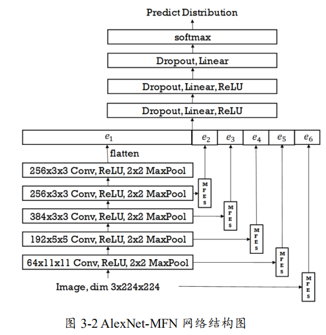
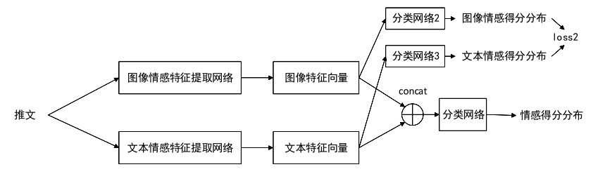

# 社交网络推文情感分类系统 #

* 针对图像情感分类问题设计了一种**对多级图像特征进行交叉组合的神经网络结构**；
* 针对图像情感分类问题设计了一种**图像情感分类模型训练算法**；
* 针对文本情感分类问题实现了一种已有的文本情感分类算法；
* 针对图像文本联合情感分类问题实现并改进了一种已有的**图像文本联合情感分类算法**
* 基于 Django 框架开发了一个社交网络推文情感分类原型系统

## 图像情感分类算法 ##

* 多级特征网络MFN

### 多级特征提取器 ###

> MFES：使用卷积神经网络的中间隐层输出作为输入，输出为特征向量

* 将输入图像和每一个卷积层的输出特征图分别输入一个 MFES，MFES 会分别生成一个一维向量，将这些输出的向量(即 e2，e3，e4，e5，e6)与原卷积神经网络的输出向量 e1 拼接，作为全连接神经网络的输入特征

#### 三种结构 ####

*  MFES-A：从输入特征图 F 中提取出在这 K 个特征上的得分，以向量形式输出
*  MFES-B：提取多级特征向量的同时，利用注意力机制进行重校准
*  MFES-C：先对输入特征图F进行channel-wise重校准，得到具有更强表达能力的特征图，再提取多级特征

### 多级特征交叉分类器 ###

> MFIC：利用 FM 模型显式地引入交叉特征，以增强分类器的表达能力，提高分类准确率

分类器部分，存在两条并行支路：

* 全连接神经网络
* 特征交叉部分：它将特征向量依次送入转换层和 FM 层，输出一个向量

 FM 部分计算得到的该输入在各个分类器类别上的几率，与全连接神经网络计算得到的得分相加用于计算最后的预测分布
$$
\begin{array}{c}{\mathbf{y}=\mathbf{y}_{\mathrm{nn}}+\mathbf{y}_{\mathrm{fm}}} \\ {\mathbf{p}=\operatorname{softmax}(\mathbf{y})}\end{array}
$$

#### 转换层 ####

> 将特征向量𝒆，转化为离散向量

* 将$e_2、e_3、e_4、e_5、e_6$每一维转换为一个0/1离散变量
* 对$e_1$进行全局最大池化：$e_{1}^{\prime}=G_{\max }\left(e_{1}\right)$

$$
\mathbf{u}=\mathbf{I}\left(\operatorname{sigmoid}\left(\left[\boldsymbol{e}_{1}^{\prime}, \boldsymbol{e}_{2}, \boldsymbol{e}_{3}, \boldsymbol{e}_{4}, \boldsymbol{e}_{5}, \boldsymbol{e}_{6}\right]\right)>0.5\right)
$$

* 对向量按位比较大小返回一个值为真或假的向量，u中每一维都为 0/1 离散变量

#### FM层 ####

> 输出为特征向量u在 K 个类别上的得分

* 三部分信息：偏置项、一阶特征信息、二阶特征信息
* 对于二阶特征信息，将向量内积拼接并送入一个全连接层进行计算

$$
\begin{array}{c}{\mathbf{h}=\left[\mathbf{u}_{1} \cdot \mathbf{u}_{2} \mathbf{V}_{1}^{\mathrm{T}} \mathbf{V}_{2}, \mathbf{u}_{1} \cdot \mathbf{u}_{3} \mathbf{V}_{1}^{\mathrm{T}} \mathbf{V}_{3}, \cdots, \mathbf{u}_{1} \cdot \mathbf{u}_{\mathrm{d}} \mathbf{V}_{1}^{\mathrm{T}} \mathbf{V}_{\mathrm{d}}\right.} \\ {\mathbf{u _ { 2 }} \cdot \mathbf{u}_{3} \mathbf{V}_{2}^{\mathrm{T}} \mathbf{V}_{3}, \cdots, \mathbf{u}_{2} \cdot \mathbf{u}_{\mathrm{d}} \mathbf{V}_{2}^{\mathrm{T}} \mathbf{V}_{\mathrm{d}}} \\ {\cdots} \\ {\mathbf{u}_{\mathrm{d}-1} \cdot \mathbf{u}_{\mathrm{d}} \mathbf{V}_{\mathrm{d}-1}^{\mathrm{T}} \mathbf{V}_{\mathrm{d}} ]^{\mathrm{T}}}\end{array}\\
\mathbf{y}_{\mathrm{fm}}=\mathbf{b}_{\mathrm{fm}}+\mathbf{W}_{\mathrm{fm}} \mathbf{u}+\mathbf{W}_{\mathrm{fm}}^{2} \mathbf{h}
$$

### 学习方式 ###

* 学习率：卷积网络部分 0； MFES部分 0.001 分类器部分 0.01
* 优化方式：带有动量的随机梯度下降算法
  * 动量(momentum)的值为 0.9
* 一共训练 80个 epoch(训练一个 epoch 即为计算整个训练集一次)，每训练 20 个 epoch 将整个网络的学习率乘 0.1
* 权重衰减(weight decay)的参数为 0.001
* 以 50%的概率将图像进行翻转
* 对图像进行裁剪，以及均值中心化操作

## 图像情感分类模型训练方法 ##

### 自动标注算法 ###

> TIS算法：使用文本图像情感模型对文本内容情感进行预测，结合文本情感概率得分和图像情感概率得分，最终确定该图像是否能通过筛选录入数据集，以及录入图像的标签
>
>  A ：图像情感分类模型
>  B：文本情感分类模型 
>
>  α：文本情感分类的阈值
>
>  [β, γ]：图像情感分类的范围阈值

* （a）等待爬虫爬取数据，爬取到一条数据转到(b)；

* （b）如果该条数据包含一张图片与其对应的文本描述信息，转到(c)。否则此数据无效，转到(a)重新等待爬虫爬取数据；

* （c） 使用模型 B 对文本内容预测文本情感，如有任意情感类别得分超过α，转到(d)。否则此数据无效，转到(a)重新等待爬虫爬取数据；

* （d） 使用模型 A 对图像预测情感，转到(e)；

* （e） 对于条件“对于某情感类别，该类别文本情感得分超过阈值α，且该类别图像情感得分在区间[β, γ]之中”，若没有一个情感类别满足条件，此数据无效，转到(a)重新等待爬虫爬取数据；

  判断该图像是否与数据集中图像重复，如重复转(a)；若有多个情感类别满足该条件，转到(f)。否则有且仅有一个条件满足该条件，转到(g)；

* （f） 选择文本情感得分最高的类别，作为该图像的情感类别，将该图像与该类别加入数据集，转到(a) 等待爬虫爬取数据；

* （g） 选择满足(e)中条件的情感类别，判断图像与该类别加入数据集，转到(a) 等待爬虫爬取数据；

### 图像去重算法 ###

> CH

* 初始化

  * 存储Histogram特征向量的数组hist
  * 存储疑似重复图片的数组rep

* 遍历公开数据集图片(N)，计算其Histogram特征向量h，另`hist[i] = h`

* 遍历弱标注数据集中的每一张图片，计算其Histogram特征向量h，遍历hist数组中存储的Histogram向量`hist[j]`，计算h与`hist[j]`的距离为dist，将`(dist,N+i,j)`加入数组rep

* 对rep按照距离从小到大排序，对图像进行**人工审查**，找出重复图片。

  * 当 dist 增大到一定程度，之后的图片差距过大可以无需继续人工审查

* **计算Histogram特征向量**：对图片的 RGB 三个通道，分别计算像数值为 t(t ∈ [0,255])的像素点的个数，存储在向量`ans`中，`ans`的长度为255×3，返回向量$ans/||ans||$

* **计算距离向量**：利用余弦距离
  $$
  \operatorname{distance}(\mathbf{a}, \mathbf{b})=\frac{\sum_{i} \mathbf{a}_{i} \mathbf{b}_{\mathbf{i}}}{\|\mathbf{a}\|\|\mathbf{b}\|}=\sum_{i} \mathbf{a}_{\mathbf{i}} \cdot \mathbf{b}_{\mathbf{i}}
  $$

## 图像文本联合情感分类 ##

### 文本情感分类算法  ###

- 数据处理：数据清洗、中文分词、停用词

- 采用 word2vec 模型中的 skip-gram 模型进行训练：将词语序列转换为向量序列

  - 输入N维的one-hot向量
  - 隐含层的权重矩阵：词向量

- 将词序列转化得到的向量序列按顺序依次输入 LSTM，使用 LSTM 对文本内容计算特征向量，将输入得到的隐含状态进行**按位相加**作为文档的压缩表示
  $$
  \mathbf{e}=\sum_{t=1}^{\mathrm{T}} \mathbf{h}_{\mathrm{t}}
  $$

- 将文本内容的向量压缩表示输入全连接神经网络分类

  * 神经网络结构为：“全连接层——ReLU 激活函数——Dropout层——全连接层——ReLU激活函数——Dropout层——全连接层”

### 图像文本联合情感分类算法 ###

* 使用两个神经网络分别提取文本内容和图像内容的特征向量，对两个特征向量进行拼接并使用第三个神经网络对拼接以后的特征向量进行分类
* 在损失函数中，针对性地加入了对图像特征向量与文本特征向量的关联信息的利用，提升了训练得到的模型的准确率

#### 图像文本信息结合模型 ####

> VTFN：图像文本混合网络

* ResNet101-MFN-C 图像情感分类网络的卷积神经网络部分提取图像情感特征向量
*  LSTM 神经网络提取文本特征向量
* 将两个向量拼接为一个向量，送入分类器

* 图像部分：将模型 ResNet101 的最后一个 Global Average Pooling 层和 MFES-C 输出的向量拼接，作为图像特征向量$e_{visual}$
* 文本部分：将 LSTM 的所有隐含向量$h_t$进行按位相加，得到文本特征向量$e_{textual}$
* 将两个特征向量拼接，送入全连接网络进行情感类别几率

$$
\begin{array}{c}{\mathbf{e}=\left[\mathbf{e}_{\text { visual }}, \mathbf{e}_{\text { textual }}\right]} \\ {\mathbf{h}_{1}=\text { Dropout }\left(\operatorname{ReLU}\left(\mathbf{W}_{1} \mathbf{e}+\mathbf{b}_{1}\right)\right)} \\ {\mathbf{h}_{2}=\text { Dropout }\left(\operatorname{ReLU}\left(\mathbf{W}_{2} \mathbf{h}_{1}+\mathbf{b}_{2}\right)\right)} \\ {\mathbf{z}=\mathbf{W}_{3} \mathbf{h}_{2}+\mathbf{b}_{3}}\end{array}\\
\mathbf{p}=\operatorname{softmax}(\mathbf{z})
$$

* 损失函数使用该情感类别概率与训练集标签的交叉熵
  $$
  \ell=-\log \mathbf{p}_{\mathbf{y}}=-\log \left(e^{-z_{y}} / \sum_{j} e^{-z_{j}}\right)
  $$

#### 引入相关性损失函数 ####

训练时损失函数分为两个部分：

* `loss_label`为分类器的输出与样本类别之间的交叉熵

* `loss_relativity`：对文本情感类别和图像情感类别的概率分布求交叉熵

  * 将图像特征向量和文本特征向量送入两个全连接神经网络，两个全连接神经网络分别输出几率 logit
  * 计算文本情感类别和图像情感类别的概率分布
  * 对概率分布进行平滑处理：引入一个超参数 T，在计算 softmax 的阶段进行平滑
    * 除了该样本类别归属信息以外，平滑后还包含了不同类别之间的相似信息
  * 求交叉熵

  $$
  \operatorname{loss}_{re} = \sum_{i=1}^K\frac{exp\{{\frac{z_i}{T}}\}}{\sum_{j=1}^{k}exp\{{\frac{z_j}{T}}\}}log\frac{exp\{{\frac{v_i}{T}}\}}{\sum_{j=1}^{k}exp\{{\frac{v_j}{T}}\}}\\
  \operatorname{loss}=(1-\lambda) \operatorname{loss}_{l a}+\lambda \operatorname{loss}_{r e}
  $$

### 实验 ###

* 使用公开数据集 MVSO-EN 的文本数据和图像数据

* 筛选出文本描述描述不少于 5 个词并且不多于150 个词的文本图片对，使用其 ANP(形容词-名词对) 的情感类别作为类别标签训练模型

* 对于ANP 的八个情感类别，对四个不同的情感类别的 ANP 进行人工标注，对四个与本课题相似的情感类别的 ANP 进行人工验证

* 超参数设置

  * 分类器部分初始学习率设置为 0.001

  * 卷积神经网络和 LSTM 将初始学习率设置为 0.0002

  * 使用随机梯度下降算法的变种Adam 进行优化，参数 beta设置为 0.9 和 0.999

  * 设置权重衰减(weight decay)的参数为 0.001

  * 训练每一个 epoch 时，从愉快、满足与悲伤三个类别中采样出 200000 条数据，其他类别数据量保持不变。共训练80epoch

    