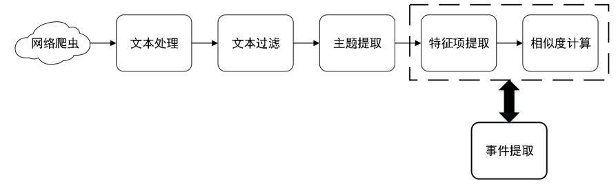

## 食品安全事件检测算法 ##

* 将爬虫获得的新闻数据进行预处理后进行文本向量化

* 利用训练好的分类算法模型判别该数据是否属于食品安全相关数据

* 对于属于食品安全的相关数据，要使用 LDA 主题模型利用Gibbs 采样预测其主题

  * 若主题已存在，则将该文档加入已有主题中
  * 否则，生成一个新主题，并在主题中创建新事件

* 特征提取（命名实体识别）：利用训练好的BiLSTM-CRF 模型识别出与食品安全相关的新闻数据中人名或机构名、地名、时间以及食品安全专有名词

* 相似度计算：利用文本中的食品安全专有名词和文本数据进行相似度计算

* 如果相似度小于阈值，将新闻归入已有的事件；若大于则在主题中创建新事件

### 爬取数据 ###

* 主题爬虫爬取相关新闻数据，人工从主题数据中找出事件数

### 文本处理 ###

* 数据清洗
* 中文分词
* 去除停用词

#### 文本表示模块——向量化 ####

* 使用神经网络模型中 word2vec 模型训练词向量
* 利用训练好的 word2vec 模型将输入的词语转化为词向量表示
* 将词向量按照文本顺序拼装，生成词向量矩阵

### 文本过滤模块 ###

> 采用支持向量机（SVM）算法对文本预处理后的文档进行分类，过滤掉与食品安全无关的文本

* 人工标记数据集
  * 与食品安全相关：主题爬虫爬取和食品安全相关的新闻
  * 与食品安全无关：爬取与娱乐、体育相关的新闻数据
  * 按 7:3 划分训练集和测试集
* 将训练集输入训练分类器模型，测试集输入用来评估整个模型效果
  * 评价指标：混淆矩阵
* 对新闻文档进行判别，过滤掉与食品安全无关的文档

### 主题提取模块 ###

> 给定一篇文档，通过训练好的 LDA 模型预测出该食品安全相关文档所隐藏的主题词集合

* 确定最优主题数T（使困惑度最小）
* 将构建的最优模型存储在文件中
* 新文档需要确定主题时，加载已保存的主题模型，预测文档的主题分布

### 事件提取模块 ###

#### 特征项提取 ####

> 提取新闻文档中食品安全专有名词、标记食品安全名词、人名、地名、机构名

* 采用BiSLTM-CRF模型对句子进行标注
  * PER（人名）、LOC（地名）、FOOD（食品安全专有名词）、ORG（机构名）

* 将训练好的模型存储

#### 文本相似度计算 ####

> 计算新文档与事件的相似度，用来判断该文档是否属于新事件

$$
\operatorname{Sim}\left(N_{1}, N_{2}\right)=\theta_{1} \operatorname{Sim}\left(x_{1}, x_{2}\right)+\theta_{2}\operatorname{Sim}\left(y_{1}, y_{2}\right)\\
\operatorname{Sim}(X, Y)=0.5+0.5 * \cos (X, Y)\\
\cos (\mathrm{X}, \mathrm{Y})=\frac{\sum_{i=1}^{n}\left(x_{i} y_{i}\right)}{\sqrt{\sum_{i=1}^{n} x_{i}^{2}} \times \sqrt{\sum_{i=1}^{n} y_{i}^{2}}}
$$

N：文本数据；x：食品专有名词向量；y：文本数据向量

* 若相似度小于阈值，则新增一个事件
* 若相似度大于阈值，则归为该事件之中

## 食品安全事件分析 ##

* 结合食品安全现有语料库以及爬取文本建立的相关语料库
* 基于词向量和 TextCNN（文本卷积神经网络）进行情感倾向分析

### 词向量构建模块 ###

* 数据处理：数据清洗、中文分词、停用词
* 采用 word2vec 模型中的 skip-gram 模型进行训练
  * 输入N维的one-hot向量
  * 隐含层的权重矩阵：词向量

### 分类器模块 ###

> 文本卷积神经网络

* 输入层：输入词向量（文本序列中各词汇的词向量表示）
* 卷积层
  * 输入文本中各词对应的词向量矩阵
  * 窗口值：相邻该词前后N词的信息
* 池化层：最大值池化
  * 结合卷积层进行特征提取
  * 提取的特征值组成特征图
* 全连接层：类似于分类器，经过softmax激活函数，得到分类结果

